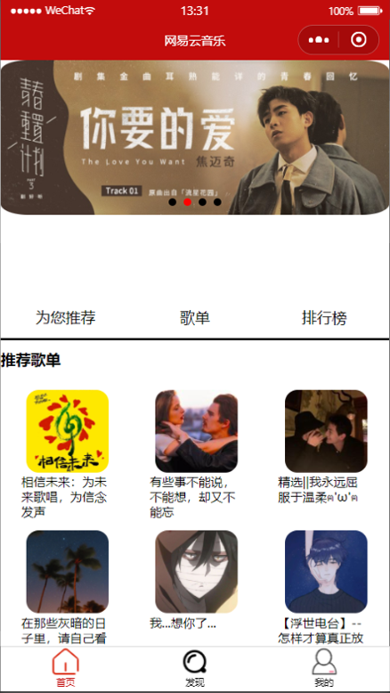
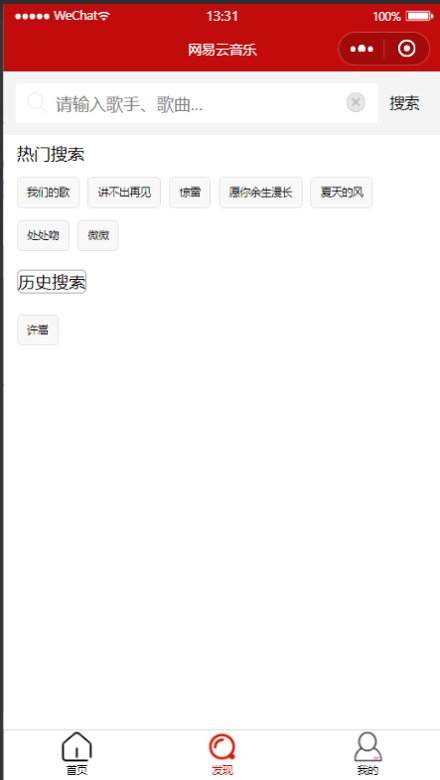
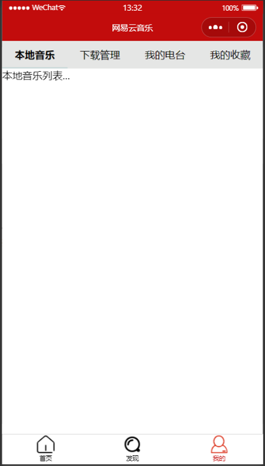
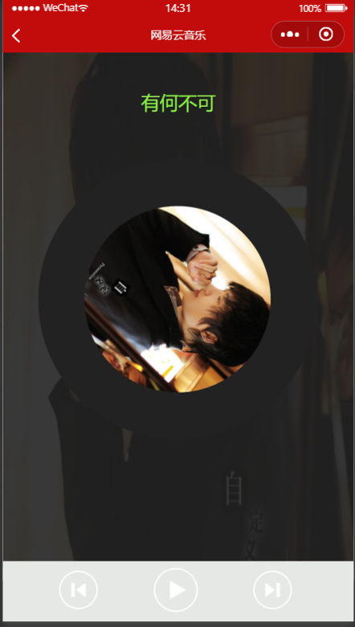
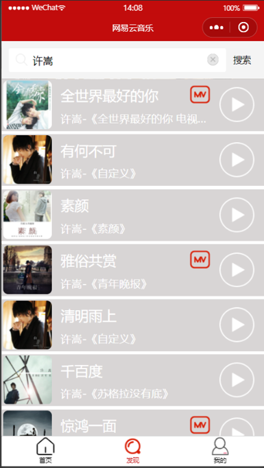

#### 项目效果展示



<center>图1 首页</center>




<center>图2 搜索</center>




<center>图3 我的页面</center>




<center>图4 歌曲播放页面</center>





<center>图5 搜索结果</center>


#### Hbuilder基本使用

1. Hbuilder是否注册登录都可

2. 创建项目步骤:

​    a. Hbuilder左边项目管理器，空白处右键，新建Web项目

​    b. 设置代码存放位置(项目名称不要以中文命名)

3. Web项目基本结构:

​      css     样式文件夹

​      img     图片资源文件夹

​      js     js文件夹

​      index.html 默认创建的首页html文件

  4.常用快捷键: 

​    注释/取消注释:ctrl+/

​    快速删除一行:ctrl+d

​    代码提示快捷键:alt+/


#### 标签样式回顾

1. 样式写法:

  a. 行内样式(内联样式)

​    例如：`<div style="width:">  写在标签内部的  </div>`

  b. 内部样式

​    例如:

 <style type="text/css">     写在head标签的style标签中    </style>

  c. 外部样式:外部css文件夹中，使用link标签引入的

2. 选择器:id  class 标签 伪类选择器
3. 样式回顾：

​    width:宽度

​    height:高度

​    background-color：背景颜色

​    text-align:文本水平居中(注意是文本！！！)

​    line-height：垂直居中通过设置行高跟高度值保持一致来实现

​    margin-left:左外边距

​    margin:0 auto:上下外边距为0，左右是自动居中

​    background-image: url(img/guo1.jpg):给div设置背景图片

​      url:统一资源定位符 

​       路径：相对路径(推荐)、绝对路径(本地磁盘实际存在位置，应该避免使用)

​    background-size: 100% 100%; 调整背景图片大小  宽高都是100%

​    background-repeat: no-repeat 设置不平铺

​    border-radius: 50%;边框圆角化(div变圆)

 

#### 动画样式学习

```css
1.	/*1.1------------ 
2.	动画:animation 
3.	目标：让郭老师旋转 
4.	 参数设置： 
5.	        zhuan:自定义的要执行的动画效果 
6.	        3s:动画执行一次的时间 
7.	        linear:线性的(匀速) 
8.	        infinite:循环往复 
9.	* */  
10.	animation: zhuan 3s linear infinite;  
11.	/*1.2------------ 
12.	自定义动画执行 
13.	    zhuan:要执行动画的名称 
14.	    from:动画的起始状态 
15.	    to:动画的最终状态 
16.	    transform:里面有旋转(rotate) 放大scale:使用倍数) 偏移(translate:单位是像素)等效果 
17.	    deg:角度   角度为正，顺时针旋转   角度为负，逆时针旋转 
18.	* */  
19.	@keyframes zhuan{  
20.	                from{  
21.	                    /*从0度开始旋转*/  
22.	                    transform: rotate(0deg);  
23.	                }  
24.	                to{  
25.	                    /*转到360度*/  
26.	                    transform: rotate(360deg);  
27.	                }  
28.	}  
29.	/*第二种方法:时间可以任意分段*/  
30.	0%{  
31.	    transform: rotate(0deg) scale(1);  
32.	}50%{  
33.	    transform: rotate(360deg) scale(1.5);  
34.	}100%{  
35.	    transform: rotate(0deg) scale(1);  
36.	}  
37.	  
38.	/*1.3------------- 
39.	目标：鼠标覆盖div，停止动画旋转，鼠标移开继续执行 
40.	hover:鼠标覆盖才会执行的样式 
41.	animation-play-state:动画的运行状态 
42.	取值有running(运行)和paused(暂停) 
43.	 */  
44.	.content:hover{  
45.	    /*暂停动画*/  
46.	    animation-play-state:paused;  
47.	} 
```

 

**设置屏幕大小的div**

```css
1.	/*逗号：表示html和body都会执行的样式 
2.	  让div设置宽高跟浏览器一样能够生效 
3.	*/  
4.	html,body{  
5.	    width:100%;  
6.	    height:100%;  
7.	}  
8.	#content{  
9.	    width: 100%;  
10.	    height: 100%;  
11.	    background-color: #ff5384;    
12.	}  
```


**绝对定位相关**

定位：绝对定位和相对定位

定位一般都可以配合偏移量使用

偏移量:left right top bottom

z-index: 1;绝对定位出现标签位置重复时，使用z-index调整z轴显示优先级

 

结论1：

  当给标签使用绝对定位时，标签偏移的参照物是浏览器还是父容器？

  首先查看当前标签的外部容器是否存在position属性，如果存在，以有position属性的标签为参照进行偏移，如果不存在，以浏览器为基准进行偏移

结论2：

我们发现,相对定位跟偏移量配合使用较少,因为原来的位置不好找

相对定位偏移跟什么有关系?(相对于原来的位置进行偏移)

结论3:

  相对定位一般用来给子容器设置绝对定位偏移时提供参照,而且还不会改变自身的位置

 

#### Js基本语法回顾

```js
1.	//1.1-- 变量声明:var let const   方法定义  
2.	var name = "zhangsan";  
3.	var age = 18;  
4.	function eat(){  
5.	    //控制台打印  
6.	    console.log("恰饭(　o=^•ェ•)o　┏━┓");  
7.	}  
8.	//1.2---弹框  
9.	alert("奥里给!")  
10.	//1.3---确认提示框   
11.	//confirm:返回boolean类型  
12.	// 点击确定，返回true 点击取消，返回false    
13.	if(confirm("坤坤向你发起了)){  
14.	    alert("只因你太美")  
15.	}else{  
16.	    alert("律师函警告")  
17.	}  
18.	//给标签赋值   dom对象    bom对象  
19.	//获取标签对应的对象   document:理解成整个屏幕  
20.	getElementById:根据id获取标签,返回的是标签对象  
21.	var content = document.getElementById("content");  
22.	//1.4---赋值(赋值是可以识别标签的)  
23.	content.innerHTML = "<a href='04-绝对定位.html'>嘻嘻O(∩_∩)O</a>";  
24.	//1.5---赋值(赋值不能识别标签)  
25.	content.innerText = "<a href=''>嘻嘻O(∩_∩)O</a>";  
26.	//1.6---给input框赋值用value  
27.	var myInput = document.getElementById("my_input");  
28.	myInput.value = "嘻嘻";  
29.	//1.7---getElementsByClassName:根据class获取，返回数组(集合)  
30.	var test_list = document.getElementsByClassName("test");  
31.	console.log(test_list);  
```


#### Js操作css

```javascript
1.	//1.1--- 获取标签  
2.	var content = document.getElementById("content");  
3.	//1.2--- 标签赋值  
4.	content.innerText = "奥里给";  
5.	//1.3-- 修改文字颜色  
6.	content.style.color = "white";  
7.	//1.4-- 动画置为空  
8.	content.style.animation = "none";  
9.	//1.5-- 更改图片的src  
10.	document.getElementById("my_input").src = "img/guo1.jpg"; 
```

 

**定时器**

```javascript
1.	//1.--定时器         
2.	//第一个参数：定时器要执行的方法体  
3.	//第二个参数：时间，单位是毫秒  
4.	//setTimeout:3000毫秒之后执行方法内容,且只执行一次  
5.	setTimeout(function(){  
6.	    console.log("辉姐专业~~~")  
7.	},3000)  
8.	//2.--setInterval,每隔3000毫秒执行一次方法体内容  
9.	setInterval(function(){  
10.	    console.log("辉姐专业~~~")  
11.	},3000) 
```


#### 斗鱼直播间带节奏脚本

```javascript
1. 打开斗鱼官网  
2. 登录个人斗鱼账号,保证自己的账号能够正常使用  
3. 找到弹幕输入框的标签，发现他的class为ChatSend-txt  
4. 使用js代码给输入框赋值  
    document.querySelector(".ChatSend-txt").value="从现在开始，这里是lbw广场";  
5. 找到点击发送的按钮,class为ChatSend-button   
                    document.querySelector(".ChatSend-button").click();  
6. 循环发送弹幕  
setInterval(function(){  
    document.querySelector(".ChatSend-txt").value="从现在开始，lbw接管比赛，全体起立";  
    document.querySelector(".ChatSend-button").click();  
},1000)  
7. 复读机模式:上一个人发什么我就发什么  
       1.1--找到弹幕列表的ul,class为Barrage-list  
       1.2--获取ul的最后一个li  
       1.3--提取li的弹幕内容  
      setInterval(function(){  
           document.querySelector(".ChatSend-txt").value =   
           document.querySelector(".Barrage-list").lastElementChild.innerText.split("：")[1];  
           document.querySelector(".ChatSend-button").click();  
      },1000)  
8. js脚本去做自动化测试  
```


#### 微信小程序项目目录结构：

1. pages:         存放所有页面的文件夹 

2.   index:  

3.     index.js    index的js文件 

4.     index.json   页面的配置文件 

5.     index.wxml   index的页面标签 

6.     index.wxss   index的样式 

7.   logs: 

8.     logs.js 

9.     logs.json 

10.    logs.wxml 

11.    logs,wxss 

12.utils: 

13.  util.js       工具文件 

14.app.js         app的js文件 

15.app.json        app的配置文件 

16.app.wxss        app的样式 


#### 微信小程序api

##### 1.百度搜索[微信公众平台网址](https://mp.weixin.qq.com/)

##### 2.[小程序全局配置网址](https://developers.weixin.qq.com/miniprogram/dev/reference/configuration/app.html)


#### app.json文件配置

```json
1.	{  
2.	  "pages": [                    //页面路径列表  
3.	    "pages/index/index",      
4.	    "pages/logs/logs"  
5.	  ],  
6.	  "window": {                  //全局的默认窗口表现  
7.	    "backgroundTextStyle": "light",  
8.	    "navigationBarBackgroundColor": "#fff", //导航栏背景颜色  
9.	    "navigationBarTitleText": "WeChat", //导航栏标题文字内容  
10.	    "navigationBarTextStyle": "black",  //导航栏标题颜色,只支持black和white  
11.	    "backgroundColor":"#000",           //窗口的背景颜色  
12.	    "enablePullDownRefresh":true,       //是否开启小程序的下拉刷新  
13.	    "backgroundTextStyle":"dark"        //下拉loading的样式,仅支持dark和light两个值  
14.	  },  
15.	  "tabbar":"东西太多，看下面"  
16.	  "sitemapLocation": "sitemap.json",  
17.	} 
```


#### app.json中tabbar的详细配置

```json
1.	"tabBar": {  
2.	    "selectedColor":"#c20c0c"           //选中时文字的颜色    
3.	    "color":""                         //默认文字颜色  
4.	    "list": [  
5.	      {  
6.	        "pagePath": "pages/index/index", //页面路径，必须在 pages 中先定义  
7.	        "text": "首页",                   //tab 上按钮文字  
8.	        "iconPath":"/images/my.png",         //图片路径，大小有限制  
9.	        "selectedIconPath": "/images/my-active.png" //被选中时的图标  
10.	      },  
11.	      {  
12.	        "pagePath": "pages/logs/logs",  
13.	        "text": "日志"  
14.	      }  
15.	    ]  
16.	  }
```


#### 小程序与html标签对比

1. 像素单位选择 

px:物理像素(设置多大就是多大) 

小程序：rpx(根据屏幕的大小自适应取值) 

rpx与px的转换关系不同的手机是不一样的 

iphone6:1rpx = 0.5px; 

iphone5:1rpx = 0.42px;(约等于) 

2. 标签对比 

div标签--->view标签 

详细组件查看:小程序官方文档 开发/介绍 

 

#### 歌曲列表

1. swiper:滑块视图容器 

swiper:滑块视图组件,一个swiper里面可以有多个swiper-item才能实现      滑动的效果 

属性如下: 

1. indicator-dots:是否显示面板指示点 

2. autoplay:是否自动切换  

3. interval:自动切换时间间隔 

4. circular:是否使用衔接滑动 

5. indicator-color:面板指示点颜色 

2. 弹性盒子布局 flex:flexible box 

给父容器设置弹性盒子布局之后，内部的子容器会自动分配父容器的空间 

子容器分配的方向取决于轴(主轴(水平)和交叉轴(垂直),默认是主轴方向 

display: flex; 


#### 歌曲列表页面完善

```html
1.	<!-- 歌曲列表 -->  
2.	<view class='musicContainer'>  
3.	  <!--  
4.	    左边封面 
5.	   -->  
6.	  <view class='left'>  
7.	    <image src='http://p1.music.126.net/Hy7-SszwZw-1J9kkL-129A==/109951163711246290.jpg?param=130y130'></image>  
8.	  </view>  
9.	  <!--  
10.	    中间歌曲信息 
11.	   -->  
12.	  <view class='center'>  
13.	    <!-- 歌曲名称 -->  
14.	    <view class='songName'>过去</view>  
15.	    <!-- 歌手和专辑名称 -->  
16.	    <view class='singerName'>尧顺宇-《过去》</view>  
17.	  </view>  
18.	  <!--  
19.	    右边播放图标 
20.	   -->  
21.	  <view class='right'>  
22.	    <image src='/images/play.png'></image>  
23.	  </view>  
24.	</view> 

```


#### 歌曲列表页面对应css

```css
1.	/* left左边存放封面标签的样式 */  
2.	.left{  
3.	  width: 150rpx;  
4.	  height: 150rpx;  
5.	  /* background-color: blue; */  
6.	}  
7.	/* 封面图片 */  
8.	.left image{  
9.	  width: 140rpx;  
10.	  height: 140rpx;  
11.	  /* 设置所有的外边距都是5rpx */  
12.	  margin: 5rpx;  
13.	  /* 边框圆角化 */  
14.	  border-radius: 10%;  
15.	}  
16.	/* center歌曲信息的样式 */  
17.	.center{  
18.	  width: 450rpx;  
19.	  height: 150rpx;  
20.	  /* background-color: yellow; */  
21.	}  
22.	/* 歌曲名称的样式 */  
23.	.songName{  
24.	  color: white;  
25.	  font-size: 40rpx;  
26.	  /* 设置左内边距 */  
27.	  padding-left: 20rpx;  
28.	  /* 调节上内边距 */  
29.	  padding-top: 20rpx;  
30.	}  
31.	/* 歌手和专辑的样式 */  
32.	.singerName{  
33.	  color: white;  
34.	  font-size: 32rpx;  
35.	  padding-left: 20rpx;  
36.	  padding-top: 20rpx;  
37.	}  
38.	/* right右边播放图标的样式 */  
39.	.right{  
40.	  width: 150rpx;  
41.	  height: 150rpx;  
42.	  /* background-color: green; */  
43.	}  
44.	/* 调整播放图标的样式 */  
45.	.right image{  
46.	  width:100rpx;  
47.	  height: 100rpx;  
48.	  margin-left: 27rpx;  
49.	  margin-top: 25rpx;  
50.	} 

```


#### 播放页面封面动画

```html
1.	<!-- 绘制一个大div标签,存放页面的所有内容 -->  
2.	<view class='content'>  
3.	  <!-- 设置图片作为播放页面的背景图片 -->  
4.	  <image class='img_big' src='http://p1.music.126.net/yDFbKhM9wIO0GWEuOvxhVg==/109951164007799327.jpg?param=130y130'></image>  
5.	  <!-- 显示歌名 -->  
6.	  <view class='songName'>大碗宽面</view>  
7.	  <!-- 中间区域，显示歌曲封面和歌词滚动互相切换 -->  
8.	  <swiper class='middle'>  
9.	    <!-- 存放歌曲封面 -->  
10.	    <swiper-item>  
11.	      <!-- 存放歌曲封面的view标签 -->  
12.	      <view class='cd-image'>  
13.	        <image src='http://p1.music.126.net/yDFbKhM9wIO0GWEuOvxhVg==/109951164007799327.jpg?param=130y130'></image>  
14.	      </view>  
15.	    </swiper-item>  
16.	    <!-- 存放歌词 -->  
17.	    <swiper-item></swiper-item>  
18.	  </swiper>  
19.	</view> 

```


#### 播放页面封面动画css

```css
1.	/* 直接设置div的高度100%不生效， 
2.	1. 需要设置page高度百分百才可以  
3.	2. 使用position设置绝对定位也可以实现 
4.	*/  
5.	.content{  
6.	  width: 100%;  
7.	  height: 100%;  
8.	  background-color: #222;  
9.	  position: absolute;  
10.	  left: 0rpx;  
11.	  top: 0rpx;  
12.	}  
13.	/* 播放页面的背景图，跟屏幕一样大  
14.	  注意：图片标签的bug是自带3像素左右的下边距， 
15.	  通过设置定位、display:block、浮动 
16.	*/  
17.	.img_big{  
18.	  width: 100%;  
19.	  height: 100%;  
20.	  display: block;  
21.	  /* 设置透明度  
22.	    opacity:取值范围是0到1之间小数 
23.	    0:完全透明 
24.	    1：完全不透明 
25.	  */  
26.	  opacity: 0.1;  
27.	}  
28.	/* 歌曲名称样式 */  
29.	.songName{  
30.	  width: 100%;  
31.	  /* 文字水平居中 */  
32.	  text-align: center;  
33.	  font-size: 40rpx;  
34.	  position: absolute;  
35.	  top: 80rpx;  
36.	  color: white;  
37.	}  
38.	/* 中间区域的样式，既有动画，又有歌词区 */  
39.	.middle{  
40.	  width: 100%;  
41.	  height: 700rpx;  
42.	  /* background-color: yellow; */  
43.	  position: absolute;  
44.	  top: 180rpx;  
45.	}  
46.	/* 存放封面的view标签 */  
47.	.cd-image{  
48.	  width: 600rpx;  
49.	  height: 600rpx;  
50.	  margin: 50rpx auto;  
51.	  /* background-color: green; */  
52.	}  
53.	/* 封面样式 */  
54.	.cd-image image{  
55.	  width: 400rpx;  
56.	  height: 400rpx;  
57.	  /* 旋转动画 */  
58.	  animation: zhuan 3s linear infinite;  
59.	  /* 边框圆角化 */  
60.	  border-radius: 50%;  
61.	  /* 设置图片边框        dashed(虚线)  
62.	    参数分别是：边框颜色、solid(实线) 、边框的宽度 
63.	  */  
64.	  
65.	  border: #222 solid 100rpx;  
66.	}  
67.	@keyframes zhuan{  
68.	  from{  
69.	    transform: rotate(0deg);  
70.	  }  
71.	  to{  
72.	    transform: rotate(360deg);  
73.	  }  
74.	} 

```


##### 绝对定位破坏文档流WXML

1. <!-- 测试绝对定位打破文档流的 --> 

2. **<view** class='fu'**>** 

3.  **<view** class='v1'**></view>** 

4.  **<view** class="v2"**></view>** 

5. **</view>** 

##### 绝对定位破坏文档流WXSS

1. .fu{ 

2.  width: 400rpx; 

3.  height: 400rpx; 

4.  background-color: black; 

5. } 

6. .v1{ 

7.  width: 200rpx; 

8.  height: 200rpx; 

9.  background-color: red; 

10. position: absolute; 

11.} 

12..v2{ 

13. width: 300rpx; 

14. height: 300rpx; 

15. background-color: green; 

16.} 

##### 歌词页面WXML

1. <!-- 存放歌词的可滚动标签 

2.    scroll-view:竖向滚动时，要设置高度 

3.    scroll-y:设置竖向滚动 

4.    内容超出才会出现滚动效果 

5. --**>** 

6. **<scroll-view** class='lyric-show' scroll-y="true"**>** 

7. <!-- 存放歌词的view标签 --> 

8.   **<view** class='lyric-content'**>** 

9.     **<text>**aaaaaaaaaaaaaaaaaa**</text>** 

10.     .... 

11.  **</view>** 

12.**</scroll-view>** 

##### 歌词页面WXSS

1. /* 存放歌词并且能滚动的标签 */ 

2. .lyric-show{ 

3.  **width**: 80%; 

4.  **height**: 100%; 

5.  /* background-color: blue; */ 

6.  **margin**: 0 auto; 

7. } 

8. /* 歌词外层的一个view标签 */ 

9. .lyric-content{ 

10. **width**: 100%; 

11.} 

12./* 对歌词样式调整 

13.  text:行级标签，不会换行显示 

14.*/ 

15..lyric-content text{ 

16. /* 块级标签 */ 

17. **display**: block; 

18. /* 最后一个参数设置透明度 */ 

19. **color**: rgba(255, 255, 255, 0.5); 

20. **text-align**: center; 

21. **font-size**: 34rpx; 

22. /* 调整每句歌词的行高 */ 

23. **line-height**: 30px; 

24.} 

25./* 去除滚动条 */ 

26.::-webkit-scrollbar{ 

27. **width**: 0rpx; 

28. **height**: 0rpx; 

29.} 

##### 控制条WXML

1. 1. #####  

2.  

3.   ```html 

4.   <!-- 控制条 --> 

5.   **<view** class='controls'**>** 

6.     **<image** src='/images/prev.png'**></image>** 

7.     **<image** src='/images/play.png'**></image>** 

8.     **<image** src='/images/next.png'**></image>** 

9.   **</view>** 

10.  ``` 

##### 控制条WXSS

1. /* 控制条样式 */ 

2. .controls{ 

3.  **width**: 100%; 

4.  **height**: 130rpx; 

5.  **background-color**: #c20c0c; 

6.  **position**: absolute; 

7.  bottom: 0rpx; 

8. } 

9. /* 调整控制条图标样式 */ 

10..controls image{ 

11. **width**: 95rpx; 

12. **height**: 95rpx; 

13. **margin-left**: 115rpx; 

14. **margin-top**: 16rpx; 

15.} 

##### JS语法学习WXML

1. <!-- 下面是js语法  

2.  1. 小程序中无法使用dom操作 

3.  2. 使用双向花括号的语法 

4.  WXML 中的动态数据均来自对应 Page 的 data 

5. --**>** 

6. <!--1.普通字符串变量--> 

7. **<view>**{{message}}**</view>** 

8. <!--2.遍历数组--> 

9. <!-- 当遍历数组的时候  

10.  wx:for="{{被循环的数组}}" 

11.  item:能够取到数组中的每个元素(当没有自定义变量时，默认变量是item) 

12.  自定义变量：wx:for-item 

13.  自定义变量的下标:wx:for-index 

14.  wx:key:项目中的标识符,加了可以消除警告，不加无所谓 

15.--**>** 

16.**<view** wx:for="{{heroes}}" wx:key="key" wx:for-item="item1"**>** 

17.  {{item1}}---{{index}} 

18.**</view>** 

19.<!--3.数组中元素为json对象时--> 

20.**<view** wx:for="{{students}}" wx:key="key" wx:for-item="student"**>** 

21. {{student.name}}---{{student.theme}} 

22.**</view>** 

##### JS语法学习JS

1. data: { 

2.    message:"奥里给", 

3.    heroes:["药酱","巨魔蘸酱","giao!","老八"], 

4.    students:[ 

5.     { 

6.      name:"孙笑川", 

7.      theme:"你把你闪现给我交咯" 

8.     }, 

9.     { 

10.     name:"老八", 

11.     theme:"臭豆腐，加柠檬，你看着汉堡做滴行不行" 

12.    }, 

13.    { 

14.     name:"药水哥", 

15.     theme:"今日我虽死，但还是洗漱霸王" 

16.    }, 

17.    { 

18.     name:"马老师", 

19.     theme:"这波是肉蛋葱鸡，起飞！！" 

20.    } 

21.   ] 

22.}, 

##### 歌曲列表页面数据渲染js代码

1.  songs:[ 

2.   { 

3.    name:"大碗宽面", 

4.    album:{ 

5.     picUrl:"http://p1.music.126.net/yDFbKhM9wIO0GWEuOvxhVg==/109951164007799327.jpg?param=130y130", 

6.     name:"大碗宽面" 

7.    }, 

8.    artists:"吴亦凡" 

9.   }, 

10.  { 

11.   name: "过去", 

12.   album: { 

13.    picUrl: "http://p1.music.126.net/Hy7-SszwZw-1J9kkL-129A==/109951163711246290.jpg?param=130y130", 

14.    name: "过去" 

15.   }, 

16.   artists: "尧顺宇" 

17.  }, 

18.  { 

19.   name: "模特", 

20.   album: { 

21.    picUrl: "http://p1.music.126.net/0uZ_bKtm4E188Uk9LFN1qg==/109951163187393370.jpg?param=130y130", 

22.    name: "mote" 

23.   }, 

24.   artists: "李荣浩" 

25.  }, 

26. ] 

27.}, 

##### 歌曲列表页面数据渲染wxml代码

1. <!-- 歌曲列表 --> 

2. **<block** wx:for="{{songs}}" wx:for-item="song"**>** 

3.  **<view** class='musicContainer'**>** 

4.   <!-- 

5.    左边专辑封面 

6.   --> 

7.   **<view** class='left'**>** 

8.    **<image** src='{{song.album.picUrl}}'**></image>** 

9.   **</view>** 

10.  <!-- 

11.   中间歌曲信息 

12.  --> 

13.  **<view** class='center'**>** 

14.   <!-- 歌曲名称 --> 

15.   **<view** class='songName'**>**{{song.name}}**</view>** 

16.   <!-- 歌手和专辑名称 --> 

17.   **<view** class='singerName'**>**{{song.artists}}-《{{song.album.name}}》   **</view>** 

18.  **</view>** 

19.  <!-- 

20.   右边播放图标 

21.  --> 

22.  **<view** class='right'**>** 

23.   <!-- 添加点击事件:bindtap 

24.     点击播放图标执行gotoPlay方法   

25.     lambda表达式：函数式编程 

26.   --**>** 

27.   **<image** bindtap='gotoPlay' src='/images/play.png'**></image>** 

28.  **</view>** 

29. **</view>** 

30.**</block>** 

#### 页面跳转

1. gotoPlay:**function**(){ 

2.    //跳转到播放页面 

3.    //wx.navigateTo:保留当前页面，跳转到应用内的某个页面。但是不能跳到 tabbar页面!!!! 

4.    wx.navigateTo({ 

5.     //跳转的路径 

6.     url: '/pages/play/play', 

7.    }) 

8.  }, 

#### 音频播放

1. <!-- 音频标签  

2.    src:音频路径 

3.    请求：客户端向服务器发起的叫请求 

4.    响应：服务器根据客户端请求给出的回应 

5.    audio:method取值有两种，play:播放  pause:暂停 

6. --**>** 

7. **<audio** autoplay="true" src=''**></audio>** 

8. <!--js代码--> 

9. data: { 

10.  action1:{ 

11.   method:"play" 

12.  } 

13.}, 

##### 歌曲列表页面方法传参WXML

1. <!-- 

2.    右边播放图标 

3. --> 

4. **<view** class='right'**>** 

5.  <!-- 添加点击事件:bindtap 

6.     点击播放图标执行gotoPlay方法   

7.     lambda表达式：函数式编程 

8.     事件传参：使用data传参 例如：data-id="123" data-name="张三" 

9.     注意：mp3Url在js中使用dataset获取时是mp3url(注意区分一下大小写) 

10. --**>** 

11.**<image** bindtap='gotoPlay' data-id="{{song.id}}" data-mp3Url="1.mp3"     src='/images/play.png'**></image>** 

12.**</view>** 

##### 歌曲列表页面方法传参Js

1. gotoPlay:function(e){ 

2.    //接收页面通过事件传递的当前歌曲id参数 

3.    var id = e.currentTarget.dataset.id; 

4.    //跳转到播放页面 

5.    //wx.navigateTo:保留当前页面，跳转到应用内的某个页面。但是不能跳到 tabbar 页面 

6.    wx.navigateTo({ 

7.     //携带参数跳转播放页面路径 

8.     // ?:路径和参数之间分隔符 格式：path?key=value&key2=value2 

9.     url: '/pages/play/play?musicId='+id, 

10.   }) 

11.}, 

#### 播放页面参数接收

1. /** 

2.   * 生命周期函数--监听页面加载 

3.   * options中包含上个页面传递的页面信息(参数) 

4.   */ 

5.  onLoad: **function** (options) { 

6.   //接收songlist页面传递过来的当前要播放的歌曲id、 

7.   **var** mid = options.musicId; 

8.   //将mid给data中的musicId赋值 

9.   //this:当前对象 

10.  **this**.setData({ 

11.   musicId:mid 

12.  }) 

13. }, 

14.// wxml页面audio歌曲id赋值 

15.<audio action="{{action1}}" src='http://music.163.com/song/media/outer/url?id={{musicId}}.mp3'></audio> 

##### 播放页面暂停播放图标切换JS代码

1. /** 

2.   * 暂停与播放 

3.   */ 

4.  pauseOrPlay:**function**(){ 

5.   //获取当前歌曲是什么状态？播放？ 暂停？ 

6.   **var** state = **this**.data.state; 

7.   //判断当前的状态(state) 

8.   **if**(state=='play'){ 

9.    //修改为暂停状态 

10.   **this**.setData({ 

11.    action1:{ 

12.     method:"pause" 

13.    }, 

14.    state:"pause" 

15.   }) 

16.  }**else**{ 

17.   //修改为播放状态 

18.   **this**.setData({ 

19.    action1:{ 

20.     method:"play" 

21.    }, 

22.    state:"play" 

23.   }) 

24.  } 

25. 

26. }, 

##### 播放页面暂停播放图标切换WXML代码

1. <!-- 控制条 --> 

2.  **<view** class='controls'**>** 

3.   **<image** src='/images/prev.png'**></image>** 

4.   <!--  

5.    点击事件：控制暂停与播放 

6.    state是play时，代表当前歌曲是播放状态，所以显示pause.png 

7.    state是pause时，代表当前歌曲时暂停状态，所以显示play.png 

8.    三元运算符： 表达式1?结果1:结果2 

9.          当表达式1为true时，取结果1，为false时，取结果2 

10.         例如： 2**>**3?"嘻嘻":"哈哈" 

11.   --**>** 

12.  **<image** bindtap='pauseOrPlay' src='/images/{{state=="play"?"pause":"play"}}.png'**></image>** 

13.  **<image** src='/images/next.png'**></image>** 

14. **</view>** 

##### 根据歌曲ID获取歌曲信息JS代码

1. /** 

2.   * 定义根据歌曲id获取歌曲详情的方法 

3.   */ 

4.  getMusicInfoById:**function**(){ 

5.   //获取当前正在播放歌曲的id 

6.   **var** musicId = **this**.data.musicId; 

7.   //用that记录下this（因为请求像用回调函数之后，this会改变，在没变之前存下来）!!!! 

8.   **var** that = **this**; 

9.   //使用歌曲id向网易云音乐服务器发请求 

10.  wx.request({ 

11.   //url:发起请求的后台路径 

12.   url: 'https://music.163.com/api/song/detail/?id=' + musicId + '&ids=[' + musicId+']', 

13.   //success:接口调用成功的回调函数 

14.   //res:result---->服务器给前端的响应内容 

15.   success:**function**(res){ 

16.    //解析之后的歌曲对象 

17.    **var** resultSong = res.data.songs[0]; 

18.    //将resultSong赋值给data中的song 

19.    that.setData({ 

20.     song:resultSong 

21.    }) 

22.   }, 

23.   //fail:接口调用失败的回调函数 

24.   fail:**function**(){ 

25. 

26.   } 

27.  }) 

28. }, 

##### 根据歌曲ID获取歌曲信息WXML

1. **<view** class='content'**>** 

2.  <!-- 设置图片作为播放页面的背景图片 --> 

3.  **<image** class='img_big' src='{{song.album.picUrl}}'**></image>** 

4.  <!-- 显示歌名 --> 

5.  **<view** class='songName'**>**{{song.name}}**</view>** 

6.  .... 

7. **</view>** 

##### 根据id获取歌词

1. /** 

2.   * 根据歌曲id获取歌词 

3.   */ 

4.  getLyricById:**function**(){ 

5.   //获取当前歌曲的id 

6.   **var** musicId = **this**.data.musicId; 

7.   **var** that = **this**; 

8.   //根据歌曲id向歌词接口发请求 

9.   wx.request({ 

10.   url: 'http://music.163.com/api/song/lyric?os=pc&id='+musicId+'&lv=-1&kv=-1&tv=-1', 

11.   //成功之后执行的回调函数 

12.   success:**function**(res){ 

13.    //层层遍历获取歌词内容 

14.    **var** lyric = res.data.lrc.lyric; 

15.    //调用解析歌词的方法 

16.    that.parseLyric(lyric); 

17.   } 

18.  }) 

19. }, 

##### 正则表达式基本编写规则

1. 正则表达式：原子操作和数量描述 

2.   原子操作：abc 匹配abc 

3.        [abc] 匹配a或者b或者c  abc 

4.        [a-z] 匹配小写字母  [a-zA-Z]:匹配所有字母(大小写) 

5.        [0-9] 匹配所有的数字 也可以写 d（等价于[0-9]）  

6.        [a-zA-Z0-9]:匹配所有字母数字  

7.        点:匹配除了r n以外的任意字符 

8.   数量操作: {n}：代表前面字符的数量为n个 

9.        {m,n}:代表前面字符的数量为m个到n个 

##### 使用正则表达式解析歌词

1. /** 

2.   * 定义解析歌词的方法 

3.   * 正则表达式:正则表达式通常被用来检索、替换那些符合某个模式(规则)的文本 

4.   */ 

5.  parseLyric:**function**(lyric){ 

6.   //将lyric根据换行符切割成单行歌词 

7.   //split:切割完之后返回数组 

8.   **var** lyricArray = lyric.split("n"); 

9.   //判断数组的最后一个元素是不是空字符，如果是，去掉 

10.  **if**(lyricArray[lyricArray.length-1]==""){ 

11.   //去掉最后一个元素 

12.   lyricArray.pop(); 

13.  } 

14.  //时间规律：[00:00.000] 

15.  // console.log(""嘻嘻"")  :转义字符 

16.  **var** re = /[d{2}:d{2}.d{2,3}]/;  

17.  //使用forEach循环遍历歌词数组 

18.  lyricArray.forEach(**function**(v/*取到数组中的每个元素*/,i/*每个元素对应的下标*/,a/*正在遍历的数组*/){ 

19.   //根据正则替换歌词中的时间 

20.   //replace(被替换的内容，替换之后的内容) 

21.   **var** result = v.replace(re,"") 

22.   console.log(result) 

23.  }) 

24. }, 

##### 搜索框WXML

1. <!-- 绘制搜索框 --> 

2.  **<view** class='search-area'**>** 

3.   <!-- 存放搜索输入框的view --> 

4.   **<view** class='search-input'**>** 

5.    <!--  

6.      bindfocus:聚集焦点触发的事件 

7.      bindblur:失去焦点触发的事件 

8.      bindinput:键盘输入时触发事件 

9.      (输入框中的内容发生改变就会触发) 

10.   --**>** 

11.   **<input** bindinput='getKeyWord'**></input>** 

12.  **</view>** 

13.  <!-- 搜索view标签  

14.     给搜索按钮添加点击事件 

15.  --**>** 

16.  **<view** bindtap='doSearch' class='search-button'**>**搜索**</view>** 

17. **</view>** 

##### 搜索框WXSS

1. /* 搜索样式 */ 

2. /* 搜索框 */ 

3. .search-area{ 

4.  **width**: 100%; 

5.  **height**: 110rpx; 

6.  /* background-color: black; */ 

7.  /* 弹性盒布局 */ 

8.  **display**: flex; 

9. } 

10./* 存放输入框的view */ 

11..search-input{ 

12. **width**: 600rpx; 

13. **height**: 110rpx; 

14. /* background: green; */ 

15.} 

16./* 搜索框的样式 */ 

17..search-input input{ 

18. **width**: 600rpx; 

19. **height**: 106rpx; 

20. /* 调整左内边距 */ 

21. **padding-left**: 20rpx; 

22. /* 添加边框 */ 

23. **border**: #c20c0c solid 1rpx; 

24.} 

25./* 搜索按钮样式 */ 

26..search-button{ 

27. **width**: 150rpx; 

28. **height**: 110rpx; 

29. **background-color**: #c20c0c; 

30. **color**: white; 

31. **text-align**: center; 

32. /* 垂直居中设置行高跟高度值保持一致 */ 

33. **line-height**: 110rpx; 

34.} 

##### 搜索框JS

1. /** 

2.   1. 获取输入的关键字 

3.   * 

4.   */ 

5.  getKeyWord:**function**(e){ 

6.   //获取输入框中的内容 

7.   **var** value = e.detail.value; 

8.   //给data中的关键字赋值 

9.   **this**.setData({ 

10.   kw:value 

11.  }) 

12. }, 

13./** 

14. * 2.点击搜索按钮时触发的方法 

15. */ 

16.doSearch:**function**(){ 

17.  //获取关键字 

18.  **var** kw = **this**.data.kw; 

19.  **var** that = **this**; 

20.  **if**(kw!=""){ 

21.   //根据关键字搜索歌曲(发请求) 

22.   wx.request({ 

23.    url: 'https://music.163.com/api/search/get?s=' + kw + '&type=1&limit=6', 

24.    success: **function** (res) { 

25.     //搜索解析之后的结果 

26.     **var** resultSongs = res.data.result.songs; 

27.     that.setData({ 

28.      songs: resultSongs 

29.     }) 

30.      **var** searchIds = []; 

31.     //遍历resultSongs,获取所有的歌曲id，并存放到数组中 

32.     **for**(**var** i=0;i<resultSongs.length;i++){ 

33.      searchIds.push(resultSongs[i].id) 

34.     } 

35.    //清空图片的数组 

36.     that.setData({ 

37.     albumPicUrls:[] 

38.     }) 

39.     //专辑封面通过id访问歌曲详情接口获取 

40.     that.getMusicImageById(searchIds,0,searchIds.length); 

41.    } 

42.   }) 

43.  } 

44. }, 

##### 递归获取歌曲封面

1. /** 

2.  * 根据歌曲id获取歌曲封面 searchIds:搜索出来的存放所有id的数组 

3.  * 结论：不要在for循环写异步请求，返回的结果顺序不一定跟请求顺序保持一致 

4.  *    可以使用递归解决 

5.  * 递归(直接或者间接的调用自己) 

6.  *   从哪儿开始，到哪儿结束 

7.  * 方法参数：存放所有id的数组  数组的下标(从0开始) 数组的长度 

8.  */ 

9. getMusicImageById:**function**(searchIds,i,length){ 

10. //根据传递的下标获取id 

11. **var** id = searchIds[i]; 

12. **var** that = **this**; 

13. //使用全局变量存储封面 

14. **var** albumPicUrls = **this**.data.albumPicUrls; 

15. //根据id发请求 

16. wx.request({ 

17. url: 'https://music.163.com/api/song/detail/?id='+id+'&ids=['+id+']', 

18.  success:**function**(res){ 

19.   //获取当前歌曲的封面 

20.   **var** picUrl = res.data.songs[0].album.picUrl; 

21.   //将封面存储到albumPicUrls 

22.   albumPicUrls.push(picUrl); 

23.   that.setData({ 

24.    albumPicUrls:albumPicUrls 

25.   }) 

26.   //递归调用 加条件限制 

27.   // i++:先赋值后计算 

28.   // ++i:先计算后赋值 

29.   // 1<6  2 

30.   // 2<6  3 

31.   // 3<6  4 

32.   // 4<6  5 

33.   // 5<6  6 

34.   // 6<6 递归结束 

35.   **if**(++i<length){ 

36.    that.getMusicImageById(searchIds,i,length) 

37.   } 

38.  } 

39. }) 

40.}, 

##### 搜索歌曲后页面歌曲列表赋值WXML

1. <!-- 歌曲列表 --> 

2. **<block** wx:for="{{songs}}" wx:for-item="song" wx:for-index="i"**>** 

3.  **<view** class='musicContainer'**>** 

4.   <!--  

5.    左边专辑封面 

6.    albumPicUrls:存放所有专辑的数组，借助songs的下标i取值 

7.   --**>** 

8.   **<view** class='left'**>** 

9.    **<image** src='{{albumPicUrls[i]}}'**></image>** 

10.  **</view>** 

11.  <!-- 

12.   中间歌曲信息 

13.  --> 

14.  **<view** class='center'**>** 

15.   <!-- 歌曲名称 --> 

16.   **<view** class='songName'**>**{{song.name}}**</view>** 

17.   <!-- 歌手和专辑名称  

18.     song.artists[0].name:我偷懒，只取第一个歌手的名称 

19.   --**>** 

20.   **<view** class='singerName'**>**{{song.artists[0].name}}-《{{song.album.name}}》**</view>** 

21.  **</view>** 

22.  <!-- 

23.   右边播放图标 

24.  --> 

25.  **<view** class='right'**>** 

26.   <!-- 添加点击事件:bindtap 

27.     点击播放图标执行gotoPlay方法   

28.     lambda表达式：函数式编程 

29.     事件传参：使用data传参 例如：data-id="123" data-name="张三" 

30.   --**>** 

31.   **<image** bindtap='gotoPlay' data-id="{{song.id}}" data-mp3Url="1.mp3" src='/images/play.png'**></image>** 

32.  **</view>** 

33. **</view>** 

34.**</block>** 

##### 进度条实现WXMl

1. **<view** class="content"**>** 

2.   ..... 

3.   <!-- 进度条 --> 

4.  **<view** wx:if="{{endTime}}" class="progress"**>** 

5.   <!-- 播放时间 --> 

6.   **<view** class="play_time"**>**{{playTime}}**</view>** 

7.   <!-- 滑动选择器，进度条效果  

8.     block-size:滑块大小 

9.     block-color:滑块颜色 

10.    activeColor:已选择的颜色 

11.    min:进度条最小取值 

12.    max:进度条最大取值(这里我们设置为歌曲总时长) 

13.    value:进度条取值（这里是歌曲的当前播放进度） 

14.    bindchange:完成进度条拖动之后触发的方法 

15.  --**>** 

16.  **<slider** bindchange="dragProgress" max="{{max}}" value="{{move}}" block-size="15" block-color="#c20c0c" activeColor="#c20c0c"**></slider>** 

17.  <!-- 结束时间 --> 

18.  **<view** class="end_time"**>**{{endTime}}**</view>** 

19. **</view>** 

20.  .... 

21.**</view>** 

##### 进度条实现WXSS

1. /* 进度条样式 */ 

2. .progress{ 

3.  **width**: 100%; 

4.  **height**: 100rpx; 

5.  /* background-color: green; */ 

6.  **position**: absolute; 

7.  bottom: 180rpx; 

8.  **display**: flex; 

9. } 

10./* 调整播放时间play_time和结束时间end_time的样式 */ 

11..play_time,.end_time{ 

12. **width**: 15%; 

13. **height**: 100%; 

14. **color**: white; 

15. **margin-top**: 20rpx; 

16.} 

17./* 调整进度条样式 */ 

18..progress slider{ 

19. **width**: 70%; 

20. **height**: 100%; 

21.} 

##### 进度条实现JS

1. /** 

2.   * 1.----歌曲进度改变时,触发执行的方法 

3.   */ 

4.  changeTime:**function**(e){ 

5.   //1.---进度条实现 

6.   //获取当前的歌曲播放进度   

7.   **var** currentTime = e.detail.currentTime; 

8.   //获取歌曲的总时长 

9.   **var** duration = e.detail.duration; 

10.  //1.---将当前歌曲进度转换为几分几秒的格式 

11.  // 121秒----》02:01 

12.  //计算播放时长的分 

13.  //Math.floor：向下取整 3.12-->3 

14.  //Math.ceil:向上取整 

15.  //Math.round:四舍五入 

16.  **var** playMinutes = Math.floor(currentTime/60); 

17.  //计算播放时长的秒 

18.  **var** playSeconds = Math.floor(currentTime%60); 

19.  **if**(playMinutes<10){ 

20.   playMinutes = "0"+playMinutes; 

21.  }  

22.  **if**(playSeconds<10){ 

23.   playSeconds = "0"+playSeconds; 

24.  } 

25.  //2.---将歌曲总时长转换为几分几秒的格式 

26.  **var** endMinutes = Math.floor(duration/60); 

27.  **var** endSeconds = Math.floor(duration%60); 

28.  **if** (endMinutes < 10) { 

29.   endMinutes = "0" + endMinutes; 

30.  } 

31.  **if** (endSeconds < 10) { 

32.   endSeconds = "0" + endSeconds; 

33.  } 

34.  //给data中的max和move、playTime、endTime赋值 

35.  **this**.setData({ 

36.   max:duration, 

37.   move:currentTime, 

38.   playTime:playMinutes+":"+playSeconds, 

39.   endTime:endMinutes+":"+endSeconds 

40.  }) 

41.  ......(下面是歌词滚动部分) 

42. } 

43. 

44. /** 

45.  * 2.---拖动进度条执行的方法 

46.  */ 

47. dragProgress:**function**(e){ 

48.  //获取拖动位置的值(时间) 

49.  **var** value = e.detail.value; 

50.  //修改歌曲进度 

51.  **this**.setData({ 

52.   action1:{ 

53.    method:"setCurrentTime", 

54.    data:value 

55.   } 

56.  }) 

57. }, 

##### 歌曲MV--WXML

1. <!--1.---歌曲列表页面-->  

2. **<image** class="mv" wx:if="{{song.mvid!=0}}" data-mvid="{{song.mvid}}" bindtap="gotoMv" src="/images/MV.png"**></image>** 

3.  

4. <!--2.---mv播放页面--> 

5. **<view** class="mv"**>** 

6.  **<video** src="{{mvAddress}}" autoplay="true"**></video>** 

7. **</view>** 

8. <!-- mv简介 --> 

9. **<view** class="introduce"**>** 

10. **<view>** 

11.  <!-- 简要描述 --> 

12.  **<text** class="briefDesc" wx:if="{{mvBriefDesc}}"**>**{{mvBriefDesc}}**</text>** 

13.  <!-- 详细描述 --> 

14.  **<text** class="desc" wx:if="{{mvDesc}}"**>**{{mvDesc}}**</text>** 

15. **</view>** 

16.**</view>** 

##### 歌曲MV--WXSS

1. /*1.--歌曲列表页面样式 

2. mv图标的样式 */ 

3. .mv{ 

4.  **width**: 60rpx; 

5.  **height**: 60rpx; 

6.  **position**: absolute; 

7.  right: 0rpx; 

8.  top: 15rpx; 

9. } 

10./*2.---mv播放页面样式 */ 

11..mv{ 

12. **width**: 100%; 

13. **height**: 400rpx; 

14.} 

15..mv video{ 

16. **width**: 100%; 

17. **height**: 100%; 

18.} 

19..briefDesc{ 

20. **font-size**: 40rpx; 

21. **padding-left**: 10rpx; 

22.} 

23..desc{ 

24. **font-size**: 34rpx; 

25. **padding-top**: 20rpx; 

26. **padding-left**: 10rpx; 

27.} 

##### 歌曲MV--JS

1. /**1.---歌曲列表js代码 

2.  * 舰艇mv图标被点击的函数 

3.  */ 

4. gotoMv:**function**(e){ 

5.  //接收mvid 

6.  **var** mvid = e.currentTarget.dataset.mvid; 

7.  //跳转到mv播放页面 

8.  wx.navigateTo({ 

9.   url: '/pages/mv/mv?mvid='+mvid, 

10. }) 

11.}, 

12.   

13.---------------------------------------------------- 

14./**2.---mv播放页面js代码 

15. * 页面的初始数据 

16. */ 

17.data: { 

18. //当前mvid 

19. mvid:0, 

20. //mv简要描述 

21. mvBriefDesc:"", 

22. //详细描述 

23. mvDesc:"", 

24. //mv地址 

25. mvAddress:"" 

26.}, 

27./** 

28. * 生命周期函数--监听页面加载 

29. */ 

30.onLoad: **function** (options) { 

31. **var** mvid = options.mvid; 

32. **this**.setData({ 

33.  mvid:mvid 

34. }) 

35. //调用获取mv的方法 

36. **this**.getMvById(); 

37.}, 

38./** 

39. * 根据mvid获取mv地址 

40. */ 

41.getMvById:**function**(){ 

42. //获取mvid 

43. **var** mvid = **this**.data.mvid; 

44. **var** that = **this**; 

45. wx.request({ 

46.  url: 'https://music.163.com/api/mv/detail?id='+mvid+'&type=mp4', 

47.  success:**function**(res){ 

48.   //解析存放mv地址和简称描述等信息的对象 

49.   **var** mvObj = res.data.data; 

50.   //获取简要描述 

51.   **var** briefDesc = mvObj.briefDesc; 

52.   //获取详细描述 

53.   **var** desc = mvObj.desc; 

54.   //获取mv的地址 

55.   **var** mvAddress = mvObj.brs[720]; 

56.   that.setData({ 

57.    mvBriefDesc:briefDesc, 

58.    mvDesc:desc, 

59.    mvAddress:mvAddress 

60.   }) 

61.  } 

62. }) 

63.}, 

##### 歌曲评论--WXML

1. <!-- 歌曲评论 --> 

2.   **<swiper-item>** 

3.    <!-- 存放可以滚动的评论 --> 

4.    **<scroll-view** scroll-y="true" class="comment-show"**>** 

5.     <!-- 存放所有的评论标签 --> 

6.     **<view** class="talk-comment"**>** 

7.      **<block** wx:for="{{commentData}}" wx:for-item="comment"**>** 

8.      <!-- 存放评论人的头像 昵称 评论内容 --> 

9.       **<view** class="comment-container"**>** 

10.        <!-- 存放评论人的用户信息(头像和昵称) --> 

11.        **<view** class="comment-user"**>** 

12.          **<image** src="{{comment.user.avatarUrl}}"**></image>** 

13.          **<text>**{{comment.user.nickname}}**</text>** 

14.        **</view>** 

15.        <!-- 存放评论正文 --> 

16.        **<text** class="comment-content"**>**{{comment.content}}**</text>** 

17.      **</view>** 

18.     **</block>** 

19.    **</view>** 

20.   **</scroll-view>** 

21.  **</swiper-item>** 

##### 歌曲评论--WXSS

1. /* 评论区的样式 */ 

2. .comment-show{ 

3.  **width**: 80%; 

4.  **height**: 100%; 

5.  **margin**: 0 auto; 

6.  /* background-color: yellow; */ 

7. } 

8. /* 每一条评论的样式,存放用户信息和评论内容 */ 

9. .comment-container{ 

10. **width**: 100%; 

11. **display**: flex; 

12. flex-**direction**: column; 

13. **margin-top**: 15rpx; 

14.} 

15..comment-user{ 

16. **display**: flex; 

17. flex-**direction**: row; 

18. **margin-left**: 0rpx; 

19.} 

20./* 评论人的头像 */ 

21..comment-user image{ 

22. **width**: 100rpx; 

23. **height**: 100rpx; 

24. border-radius: 50%; 

25.} 

26./* 评论人的昵称 */ 

27..comment-user text{ 

28. **font-size**: 34rpx; 

29. **font-weight**: 600; 

30. **color**: white; 

31. **margin-top**: 25rpx; 

32. **margin-left**: 30rpx; 

33.} 

34./* 评论正文 */ 

35..comment-content{ 

36. **font-size**: 34rpx; 

37. **color**: rgba(255,255, 255, 0.5); 

38. **padding-top**: 10rpx; 

39. **padding-left**: 10rpx; 

40. /* 属性增加或减少字符间的空白 */ 

41. **letter-spacing**: 2rpx; 

42.} 

##### 歌曲评论--js

1. /** 

2.   * 根据歌曲id获取评论 

3.   */ 

4.  getCommentsById:**function**(){ 

5.   //获取当前播放歌曲的id 

6.   **var** musicId = **this**.data.musicId; 

7.   **var** that = **this**; 

8.   //发起评论请求 

9.   wx.request({ 

10.   url: 'https://music.163.com/api/v1/resource/comments/R_SO_4_'+musicId, 

11.   success:**function**(res){ 

12.    **var** hotComments = res.data.hotComments; 

13.    that.setData({ 

14.     commentData:hotComments 

15.    }) 

16.   } 

17.  }) 

18. }, 

#### 歌曲上拉触底搜索

1. /** 1.--- 

2.   * 页面上拉触底事件的处理函数 

3.   */ 

4.  onReachBottom: **function** () { 

5.   //修改查询的条数 

6.   **this**.setData({ 

7.    limit: **this**.data.limit + 5 

8.   }) 

9.   //调用搜索歌曲方法 

10.  **this**.doSearch(); 

11. }, 

12.    

13. /** 2.---添加了loading提示的搜索方法 

14.  * 点击搜索按钮时触发的方法 

15.  */ 

16. doSearch:**function**(){ 

17.  //获取关键字 

18.  **var** kw = **this**.data.kw; 

19.  **var** that = **this**; 

20.  **if**(kw!=""){ 

21.   //显示提示框 

22.   wx.showLoading({ 

23.    title: '来了，老弟！！', 

24.   }) 

25.   //根据关键字搜索歌曲(发请求) 

26.   wx.request({ 

27.    url: 'https://music.163.com/api/search/get?s=' + kw + '&type=1&limit='+that.data.limit, 

28.    success: **function** (res) { 

29.     .... 

30.     //专辑封面通过id访问歌曲详情接口获取 

31.     that.getMusicImageById(searchIds,0,searchIds.length); 

32.     //隐藏loading提示框 

33.     wx.hideLoading(); 

34.    } 

35.   }) 

36.  } 

37.   

38. }, 

##### 导航条WXML

1. <!-- 导航条 --> 

2. **<view** class="nav"**>** 

3.  **<block** wx:for="{{navs}}" wx:for-item="nav"**>** 

4.   **<view** class="{{navPosition==nav.index?'current-nav':''}}" data-index="{{nav.index}}" bindtap="changeNav"**>**{{nav.title}}**</view>** 

5.  **</block>** 

6. **</view>** 

7. <!-- 滑动模块  

8.   current:当前所在滑块的 index 

9.   bindchange:current 改变时会触发 change 事件 

10.  duration: 

11.--**>** 

12.**<swiper** duration="100" bindchange="changeSwiper" current="{{navPosition}}"**>** 

13. **<swiper-item>** 

14.  **<view** class="swiper-content"**>** 

15.   **<text>**我的页面内容........**</text>** 

16.  **</view>** 

17. **</swiper-item>** 

18. **<swiper-item>** 

19.  **<view** class="swiper-content"**>** 

20.   **<text>**发现页面内容........**</text>** 

21.  **</view>** 

22. **</swiper-item>** 

23. **<swiper-item>** 

24.  **<view** class="swiper-content"**>** 

25.   **<text>**云村页面内容........**</text>** 

26.  **</view>** 

27. **</swiper-item>** 

28. **<swiper-item>** 

29.  **<view** class="swiper-content"**>** 

30.   **<text>**视频页面内容........**</text>** 

31.  **</view>** 

32. **</swiper-item>** 

33.**</swiper>** 

##### 导航条WXSS

1. /* 导航条的样式 */ 

2. .nav{ 

3.  **width**: 100%; 

4.  **height**: 80rpx; 

5.  **background-color**: yellowgreen; 

6.  **color**: white; 

7.  **display**: flex; 

8. } 

9. /* 导航条内部每个元素的样式 */ 

10..nav view{ 

11. **width**:25%; 

12. **height**: 100%; 

13. **text-align**: center; 

14. **line-height**: 80rpx;  

15. box-sizing: border-box; 

16.} 

17./* 导航条内部被选中时执行的样式 */ 

18..nav .current-nav{ 

19. **border-bottom**: #c20c0c solid 5rpx; 

20. **font-weight**: 700; 

21.} 

22..swiper-content{ 

23. **background-color**: yellow; 

24. **width**: 100%; 

25. **height**: 600rpx; 

26.} 

##### 导航条JS

1. /** 

2.   * 1.---页面的初始数据 

3.   */ 

4.  data: { 

5.   navs:[ 

6.    { 

7.     title:"我的", 

8.     index:0 

9.    }, 

10.   { 

11.    title: "发现", 

12.    index:1 

13.   }, 

14.   { 

15.    title: "云村", 

16.    index:2 

17.   }, 

18.   { 

19.    title: "视频", 

20.    index:3 

21.   } 

22.  ], 

23.  //定义变量记录导航条的位置 

24.  navPosition:0 

25. }, 

26.    

27. /** 

28.  * 2.----鼠标点击导航栏执行的方法 

29.  */ 

30. changeNav:**function**(e){ 

31.  //接收点击的index 

32.  **var** index = e.currentTarget.dataset.index; 

33.  //修改导航条的位置 

34.  **this**.setData({ 

35.   navPosition:index 

36.  }) 

37. }, 

38. /** 

39.  * 3.----监听滑块滑动 

40.  */ 

41. changeSwiper:**function**(e){ 

42.  //获取当前滑块所在的下标 

43.  **var** current = e.detail.current; 

44.  //将滑块下标赋值给navPosition 

45.  **this**.setData({ 

46.   navPosition:current 

47.  }) 

48. }, 

#### 上一首下一首播放

1. /** 1.---歌曲列表页面歌曲id数组传参 

2.   * 监听播放图标被点击的函数   自定义 

3.   * e:event 

4.   */ 

5.  gotoPlay:**function**(e){ 

6.    //1.---获取所有歌曲id 

7.    **var** songs = **this**.data.songs; 

8.    //定义空数组存储所有歌曲id 

9.    **var** ids = []; 

10.   //遍历songs数组 

11.   **for**(**var** i=0;i<songs.length;i++){ 

12.    ids.push(songs[i].id) 

13.   } 

14.   //2.---接收页面通过事件传递的当前歌曲id参数 

15.   **var** id = e.currentTarget.dataset.id; 

16.   //跳转到播放页面 

17.   //wx.navigateTo:保留当前页面，跳转到应用内的某个页面。但是不能跳到 tabbar 页面 

18.   wx.navigateTo({ 

19.    //携带参数跳转播放页面路径 

20.    // ?:路径和参数之间分隔符 格式：path?key=value&key2=value2 

21.    url: '/pages/play/play?musicId='+id+"&ids="+ids, 

22.   }) 

23. }, 

24. /** 2.---播放页面接收歌曲id数组 

25.  * 生命周期函数--监听页面加载 

26.  * options中包含上个页面传递的页面信息(参数) 

27.  */ 

28. onLoad: **function** (options) { 

29.  //1.----接收所有歌曲的id 

30.  **var** ids = options.ids; 

31.  //对ids根据逗号进行切割 split:返回数组 

32.  ids = ids.split(","); 

33.  **this**.setData({ 

34.   ids:ids 

35.  }) 

36.  //2.----接收songlist页面传递过来的当前要播放的歌曲id、 

37.  **var** mid = options.musicId; 

38.  ... 

39. }, 

40. /**3.---上一首歌曲 

41.  * 

42.  */ 

43. prevSong:**function**(){ 

44.  //根据当前正在播放的歌曲id和所有的顺序排列的id数组，找出当前歌曲的下标 

45.  **var** currentId = **this**.data.musicId; 

46.  **var** ids = **this**.data.ids; 

47.  //定义变量记录当前歌曲的下标 

48.  **var** currentIndex = 0; 

49.  //遍历歌曲id数组，找当前歌曲id所对应的下标 

50.  **for**(**var** i=0;i<ids.length;i++){ 

51.   //根据id匹配 

52.   **if**(currentId==ids[i]){ 

53.    currentIndex = i; 

54.    **break**; 

55.   } 

56.  } 

57.  //计算上一首歌曲的下标 

58.  **var** prevIndex = currentIndex==0?ids.length-1:currentIndex-1; 

59.  //根据上一首歌曲下标找到对应的id 

60.  **var** prevId = ids[prevIndex]; 

61.  //给musicId重新赋值 

62.  **this**.setData({ 

63.   musicId:prevId 

64.  }) 

65.  **this**.setData({ 

66.   action1:{ 

67.    method:"play" 

68.   } 

69.  }) 

70.  //重新调用获取歌曲信息、歌词、评论的方法 

71.  **this**.getMusicInfoById(); 

72.  **this**.getLyricById(); 

73.  **this**.getCommentsById() 

74. }, 

75. /** 

76.  下一首自行完善 

77. */ 

#### 歌曲播放模式

1. /** 

2.  * 1.---点击更换播放模式 

3.  */ 

4. changeMode:**function**(){ 

5.  **var** mode = **this**.data.mode; 

6.  **if**(mode=="loop"){ 

7.   //列表循环点一下修改单曲循环 

8.   **this**.setData({ 

9.    mode:"single" 

10.  }) 

11. }**else** **if**(mode=="single"){ 

12.  **this**.setData({ 

13.   mode:"random" 

14.  }) 

15. }**else** **if**(mode=="random"){ 

16.  **this**.setData({ 

17.   mode:"loop" 

18.  }) 

19. } 

20.}, 

21.   

22./** 

23. * 2.----音频播放到末尾时触发的方法 

24. */ 

25.playEnd:**function**(){ 

26. //获取当前的播放模式 

27. **var** mode = **this**.data.mode; 

28. **if**(mode=="loop"){ 

29.  //播放下一首歌曲(调用下一首歌曲的方法) 

30.  //自行完善 

31. }**else** **if**(mode=="single"){ 

32.  //继续播放当前歌曲(重新给action的method赋值play) 

33.  //自行完善 

34. }**else** **if**(mode=="random"){ 

35.  //随机播放一首歌(随机下标  ids打乱) 

36. //自行完善 

37. } 

38.}, 

#### JDBC查询

1. /** 

2.  * 实现jdbc查询的功能 

3.  * @author yaojin 

4.  * 

5.  */ 

6. **public** **class** TestJdbcQuery { 

7.   **public** **static** **void** main(String[] args) { 

8.     **try** { 

9.       Class.forName("com.mysql.jdbc.Driver"); 

10.      Connection conn = DriverManager.getConnection("jdbc:mysql://localhost:3306/db_cdu_school?useSSL=true","root","root"); 

11.      // 出去开发不要写select *,不然别人会鄙视你的 

12.      // 但是我们练习时候可以偷偷写  

13.      String sql = "select * from tb_heroes"; 

14.      PreparedStatement prep = conn.prepareStatement(sql); 

15.      //执行查询操作 

16.      ResultSet res = prep.executeQuery(); 

17.      // while：不知道循环次数 for:知道循环次数  foreach 

18.      // next():返回的结果是boolean类型, 

19.      // next执行一次，游标(指针)会下移一次，判断当前行是否存在数据 

20.      // 返回结果为真，代表有数据，为假时，代表没数据 

21.      **while**(res.next()){ 

22.        //获取id(获取每列数据时可以根据列的索引，或者列名) 

23.        **int** id = res.getInt("id"); 

24.        //获取name 

25.        String name = res.getString("name"); 

26.        //获取age 

27.        **int** age = res.getInt("age"); 

28.        //获取theme 

29.        String theme = res.getString("theme"); 

30.        System.out.println(id+"---"+name+"---"+age+"---"+theme); 

31.      } 

32.    } **catch** (ClassNotFoundException e) { 

33.      e.printStackTrace(); 

34.    } **catch** (SQLException e) { 

35.      e.printStackTrace(); 

36.    } 

37.  } 

38.} 

##### MySQL表示日期和时间

1. **date**:只有日期，没有时间 

2. datetime:有日期，有时间 

3. **timestamp**:时间戳格式  不需要手动添加，可以在插入数据时自动插入当前系统时间 

4. #创建产品表的sql语句 

5. **create** **table** tb_product( 

6.  id **int** **primary** **key** auto_increment not null, 

7.  **name** **varchar**(255) not null, 

8.  start_date **date** not null, 

9.  end_date datetime not null, 

10. middle_date **timestamp** not null 

11.); 

12. 

13.***********如果想要通过navicat创建**timestamp**格式的话，需要在默认值那里选择或者手动添加CURRENT_TIMESTAMP******* 

14. 

15.#添加sql语句 

16.**insert** **into** tb_product(**name**,start_date,end_date) 

17.value('迷hotel','2022-4-25 15:10:10','2022-4-25 15:10:10'); 

##### JAVA中字符串与日期相互转换

1. //1.--- 时间转换类 

2. // MM:月份  mm:分钟  HH:24小时制  hh:12小时 

3. SimpleDateFormat sdf = **new** SimpleDateFormat("yyyy-MM-dd HH:mm:ss"); 

4. //2.---将date类型转换为字符串格式 

5. String dateStr = sdf.format(date); 

6. //将字符串时间转换为Date 

7. Date date = sdf.parse(str); 

8. //3.---当前时间毫秒数获取(从1970年1月1号零点开始计算) 

9. **long** time = System.currentTimeMillis(); 

10.//4.---时间对应毫秒数获取 

11.**long** time = date.getTime(); 

##### JDBC读取时间

1.   /** 

2.  * 读取数据库时间的方法(tb_product表) 

3.  * @throws SQLException 

4.  */ 

5. **public** **static** **void** getData() **throws** SQLException{ 

6.   //获取连接 

7.   Connection conn = JdbcUtil.getConnection(); 

8.   String sql = "select * from tb_product"; 

9.   PreparedStatement prep = conn.prepareStatement(sql); 

10.  ResultSet res = prep.executeQuery(); 

11.  **while**(res.next()){ 

12.    **int** id = res.getInt("id"); 

13.    String name = res.getString("name"); 

14.    //读取日期 数据库中是date类型 

15.    Date startDate = res.getDate("start_date"); 

16.    //读取日期，数据库是datetime类型 

17.    Timestamp endDate = res.getTimestamp("end_date"); 

18.    //读取日期，数据库是timestamp类型 

19.    //res.getTimestamp:返回值可以使用java.util.Date和Timestamp接收 

20.    Timestamp middleDate = res.getTimestamp("middle_date"); 

21.    System.out.println(id+"----"+name+"---"+startDate+"---"+endDate+"---"+middleDate); 

22.  } 

23.  //释放资源 

24.  JdbcUtil.release(conn, prep, res); 

25.} 

##### JDBC添加时间

1. **public** **static** **void** insertData() **throws** SQLException, ParseException{ 

2.     SimpleDateFormat sdf = **new** SimpleDateFormat("yyyy-MM-dd HH:mm:ss"); 

3.     //获取连接 

4.     Connection conn = JdbcUtil.getConnection(); 

5.     //插入sql语句 

6.     String sql = "insert into tb_product(name,start_date,end_date)" 

7.         + "value(?,?,?)"; 

8.     PreparedStatement prep = conn.prepareStatement(sql); 

9.     prep.setString(1, "魔法士"); 

10.    String dateStr = "2018-01-23 16:42:25"; 

11.    //给数据库中的date赋值 

12.    //java.sql.Date中没有无参构造 

13.    prep.setDate(2, **new** java.sql.Date(sdf.parse(dateStr).getTime())); 

14.    //给数据库中的datetime赋值 

15.    prep.setTimestamp(3, **new** Timestamp(sdf.parse(dateStr).getTime())); 

16.    prep.executeUpdate(); 

17.    //释放资源 

18.    JdbcUtil.release(conn, prep, **null**); 

19.} 

#### 连接池:dbcp c3p0 druid

##### 1. 为什么需要连接池?

##### 使用jdbc操作数据库时，我们的步骤主要是(加载驱动、建立连接、执行SQL、关闭资源),其中建立连接是一个非常重要的步骤，每执行一次数据库的curd都需要获取一个connection,当数据库操作不是很频繁时，影响不大，但是当数据库操作频繁时，比如在并发的场景下,成千上万个线程需要建立连接的时候，建立连接是一个非常耗时的操作，导致数据库的操作效率低下，会影响性能。为了处理这种情况，c3p0连接池将会在池中预先创建好一些连接Connection,线程需要时可以直接使用，缩短一开始的创建时间，提升了效率。而且在连接使用完毕之后，会释放到池中，但是并没有关闭资源，供下一个线程使用

##### 2.使用c3p0连接池的步骤:

**（1）导入jar包**

a. c3p0-0.9.5.2.jar(c3p0jar包)

b. mchange-commons-java.jar(c3p0辅助包,没有此包时可能报classNotFoundException)

（2）**add to build path**

**（3）编写c3p0连接池的配置文件**

1. <!-- c3p0连接池的配置 --> 

2. **<c3p0-config>** 

3.   **<default-config>** 

4.     **<property** name="driverClass"**>**com.mysql.jdbc.Driver**</property>** 

5.     **<property** name="jdbcUrl"**>**jdbc:mysql://localhost:3306/db_cdu_school**</property>** 

6.     **<property** name="user"**>**root**</property>** 

7.     **<property** name="password"**>**root**</property>** 

8.     <!-- 初始化时的连接个数 --> 

9.     **<property** name="initialPoolSize"**>**3**</property>** 

10.    <!-- 最大连接个数 --> 

11.    **<property** name="maxPoolSize"**>**15**</property>** 

12.  **</default-config>** 

13.**</c3p0-config>** 

**歌曲列表后台SongListServlet.java**

1. /** 

2.  * 获取歌曲列表的接口:查询所有的歌曲并且返回给小程序 

3.  */ 

4. @WebServlet("/SongListServlet") 

5. **public** **class** SongListServlet **extends** HttpServlet { 

6.   /** 

7.    * @see 

8.    */ 

9.   **protected** **void** doGet(HttpServletRequest request, HttpServletResponse response) **throws** ServletException, IOException { 

10.    //调用service的查询歌曲列表方法并且将结果返回给小程序 

11.    List<Music> musicList = **new** MusicService().getMusicList(); 

12.    System.out.println(musicList); 

13.    //将歌曲集合返回给小程序{name:"张三",age:"23"} 

14.    //使用gson，将javabean转换为前端所需要的json数据 

15.    String musicStr = **new** Gson().toJson(musicList); 

16.    System.out.println(musicStr); 

17.  } 

18. 

19.  **protected** **void** doPost(HttpServletRequest request, HttpServletResponse response) **throws** ServletException, IOException { 

20.    // TODO Auto-generated method stub 

21.    doGet(request, response); 

22.  } 

23.} 

**歌曲列表查询**

1. //1. -----MusicService 

2. public class MusicService { 

3.   private MusicDao musicDao = new MusicDao(); 

4.   /** 

5.    * 查询歌曲列表的方法 

6.    */ 

7.   public List<Music> getMusicList(){ 

8.     try { 

9.       return musicDao.getMusicList(); 

10.    } catch (SQLException e) { 

11.      // TODO Auto-generated catch block 

12.      e.printStackTrace(); 

13.    } 

14.    return null; 

15.  } 

16.} 

17.//2.------MusicDao 

18.public class MusicDao { 

19.  //获取数据源 

20.  private ComboPooledDataSource dataSource = new ComboPooledDataSource(); 

21.  //实例化queryrunner对象 

22.  private QueryRunner qr = new QueryRunner(dataSource); 

23.  /** 

24.   * 查询歌曲列表的方法 

25.   * @throws SQLException 

26.   */ 

27.  public List<Music> getMusicList() throws SQLException{ 

28.    String sql = "select * from tb_music"; 

29.    BeanListHandler<Music> beanListHandler = new BeanListHandler<>(Music.class); 

30.    List<Music> musicList = qr.query(sql,beanListHandler); 

31.    return musicList; 

32.  } 

33.} 

#### 后台SongListServlet代码

1. @WebServlet("/SongListServlet") 

2. **public** **class** SongListServlet **extends** HttpServlet { 

3.      

4.  

5.   /** 

6.    * @see HttpServlet#doGet(HttpServletRequest request, HttpServletResponse response) 

7.    */ 

8.   **protected** **void** doGet(HttpServletRequest request, HttpServletResponse response) **throws** ServletException, IOException { 

9.     //设置response的字符编码级别(解决返回前端数据乱码问题) 

10.    response.setCharacterEncoding("utf-8"); 

11.    //调用service的查询歌曲列表方法并且将结果返回给小程序 

12.    List<Music> musicList = **new** MusicService().getMusicList(); 

13.    System.out.println(musicList); 

14.    //将歌曲集合返回给小程序{name:"张三",age:"23"} 

15.    //使用gson，将javabean转换为前端所需要的json数据(json字符串) 

16.    String musicStr = **new** Gson().toJson(musicList); 

17.    //给小程序响应 io流 (字节(inputStream OutputStream) 字符(Reader Writer))  

18.    response.getWriter().write(musicStr); 

19.  } 

20.} 

#### 小程序段歌曲列表

1. **<block** wx:for="{{songs}}" wx:for-item="song" wx:for-index="i"**>** 

2.  **<view** class='musicContainer'**>** 

3.    <!--  

4.     左边专辑封面 

5.     albumPicUrls:存放所有专辑的数组，借助songs的下标i取值 

6.    --**>** 

7.    **<view** class='left'**>** 

8.     **<image** wx:if="{{baseUrl+song.albumPic}}" src='{{baseUrl+song.albumPic}}'**></image>** 

9.     .... 

10.   **</view>** 

11.  **</view>** 

12.**</block>** 

1. /** 2. app.js 定义全局变量 

2.  */  

3. App({ 

4.   globalData: { 

5.    baseUrl:"http://localhost:8080/music_system/" 

6.  } 

7. }) 

8. /** 2. songlist.js 

9.   * 生命周期函数--监听页面加载  预定义  

10.  */ 

11. onLoad: **function** (options) { 

12.  **var** that = **this**; 

13.  that.setData({ 

14.   baseUrl: app.globalData.baseUrl 

15.  }); 

16.  //小程序初始化时，向Java后端发请求 

17.  wx.request({ 

18.   // url:后台路径 

19.   url: 'http://localhost:8080/music_system/SongListServlet', 

20.   success:**function**(res){ 

21.    //解析后端返回的歌曲列表结果 

22.    **var** resultSongs = res.data; 

23.    that.setData({ 

24.     songs: resultSongs 

25.    }) 

26.   } 

27.  }) 

28. }, 

#### 后台SingerMusicServlet,service,dao层代码

1. /**1. Servlet 

2.  * 根据歌曲id获取歌曲对象 

3.  */ 

4. @WebServlet("/SingerMusicServlet") 

5. **public** **class** SingerMusicServlet **extends** HttpServlet { 

6.  

7.   /** 

8.    * @see HttpServlet#doGet(HttpServletRequest request, HttpServletResponse response) 

9.    */ 

10.  **protected** **void** doGet(HttpServletRequest request, HttpServletResponse response) **throws** ServletException, IOException { 

11.    response.setCharacterEncoding("utf-8"); 

12.    //接收小程序段传递的歌曲id 

13.    String musicId = request.getParameter("musicId"); 

14.    Music music = **new** MusicService().getMusicById(musicId); 

15.    String musicStr = **new** Gson().toJson(music); 

16.    response.getWriter().write(musicStr); 

17.  } 

18.} 

19.  /**2.---MusicService 

20.   * 根据歌曲id查询歌曲 

21.   */ 

22.  **public** Music getMusicById(String musicId){ 

23.    **try** { 

24.      **return** musicDao.getMusicById(Integer.parseInt(musicId)); 

25.    } **catch** (NumberFormatException e) { 

26.      e.printStackTrace(); 

27.    } **catch** (SQLException e) { 

28.      e.printStackTrace(); 

29.    } 

30.    **return** **null**; 

31.  } 

32.  /**3.---MusicDao 

33.   * 根据歌曲id查询歌曲对象 

34.   * @throws SQLException 

35.   */ 

36.  **public** Music getMusicById(**int** musicId) **throws** SQLException{ 

37.    String sql = "select * from tb_music where id=?"; 

38.    BeanHandler<Music> beanHandler = **new** BeanHandler<>(Music.**class**); 

39.    **return** qr.query(sql, beanHandler, musicId); 

40.  } 

#### 歌曲播放小程序端界面

1. **<image** class='img_big' src='{{baseUrl+song.albumPic}}'**></image>**  

2. **<view** class='songName'**>**{{song.name}}**</view>** 

3. **<audio** bindended="playEnd" bindtimeupdate="" action="{{action1}}" src='{{baseUrl+song.mp3url}}'**></audio>** 

1. /** 

2.   * 生命周期函数--监听页面加载 

3.   * options中包含上个页面传递的页面信息(参数) 

4.   */ 

5.  onLoad: **function** (options) { 

6.   **this**.setData({ 

7.    baseUrl: app.globalData.baseUrl 

8.   }); 

9.   **var** that = **this**; 

10.  //自己的后台 

11.  //接收songlist页面传递过来的当前要播放的歌曲id 

12.  **var** mid = options.musicId; 

13.  //根据mid向后端发送请求，获取当前歌曲对象 

14.  wx.request({ 

15.   url: app.globalData.baseUrl +"SingerMusicServlet?musicId="+mid, 

16.   success:**function**(res){ 

17.    that.setData({ 

18.     song:res.data 

19.    }) 

20.   } 

21.  }) 

22. }, 

### 解决频繁访问项目报错max_user_connections超出的异常

1. //数据源只初始化一次 

2. **public** **class** C3p0Util { 

3.   //获取数据源 静态只会初始化一次 

4.   **private** **static** ComboPooledDataSource dataSource = **new** ComboPooledDataSource(); 

5.    

6.   //返回已经获取连接准备做curd的QueryRunner对象 

7.   **public** **static** QueryRunner getQueryRunner(){ 

8.     **return** **new** QueryRunner(dataSource); 

9.   } 

10.} 

11.//修改之后我们的dao层应该修改为下面示例代码 

12.  /** 

13.   * 查询歌曲列表的方法 

14.   * @throws SQLException 

15.   */ 

16.  **public** List<Music> getMusicList() **throws** SQLException{ 

17.    ....... 

18.  List<Music> musicList = C3p0Util.getQueryRunner().query(sql,beanListHandler); 

19.    **return** musicList; 

20.  } 

#### 解决小程序端资源加载不及时的问题(添加判断，让资源加载跟显示同步)

1. <!-- 设置图片作为播放页面的背景图片 --> 

2. **<image** wx:if="{{song.albumPic}}" class='img_big' src='{{baseUrl+song.albumPic}}'**></image>** 

3. <!--旋转封面图片--> 

4. **<image** wx:if="{{song.albumPic}}" style='animation-play-state:{{state=="play"?"running":"paused"}}' src='{{baseUrl+song.albumPic}}'**>** 

5. **</image>** 

6. **<audio** wx:if="{{song.mp3url}}" bindended="playEnd" bindtimeupdate="" action="{{action1}}" src='{{baseUrl+song.mp3url}}'**>** 

7. **</audio>** 

#### SongList.wxml代码

1. <!-- 绘制搜索框 --> 

2.  **<view** class='search-area'**>** 

3.   <!-- 存放搜索输入框的view --> 

4.   **<view** class='search-input'**>** 

5.    <!--  

6.     indicator-style：选中框样式 

7.     使用小程序picker-view组件注意事项： 

8.     1. 子节点的高度会自动设置成与picker-view的选中框的高度一致 

9.     2. 子节点在style样式或者wxss中修改高度都是无效的 

10.    3. 子节点标签高度默认值是34px 

11.    4. indicator-style设置高度时只支持使用px物理像素，而不能用rpx, 

12.      如果强行使用rpx的话，子节点view标签的高度为默认的34px 

13.    --**>** 

14.   **<picker-view** bindchange="change" indicator-style="height:46px;" style="width:100rpx;height:110rpx;"**>** 

15.    **<picker-view-column>** 

16.     **<view** style="color:white;background:#c20c0c;text-align:center;line-height:46px;" wx:for="{{['歌手','歌曲']}}"**>**{{item}}**</view>** 

17.    **</picker-view-column>** 

18.   **</picker-view>** 

19.   <!-- 小程序里面没有select下拉菜单，可以自己画 --> 

20.   <!--  

21.     bindfocus:聚集焦点触发的事件 

22.     bindblur:失去焦点触发的事件 

23.     bindinput:键盘输入时触发事件 

24.     (输入框中的内容发生改变就会触发) 

25.   --**>** 

26.    

27.   **<input** bindinput='getKeyWord'**></input>** 

28.  **</view>** 

29.  <!-- 搜索view标签  

30.     给搜索按钮添加点击事件 

31.  --**>** 

32.  **<view** bindtap='doSearch' class='search-button'**>**搜索**</view>** 

33. **</view>** 

#### SongList.js代码

1. /**1.----- 

2.  * 获取搜索类型 

3.  */ 

4. change:**function**(e){ 

5.  //获取被选择项的下标(从0开始) 

6.  //歌手： 0  默认是歌手 

7.  //歌曲： 1 

8.  **var** searchType = e.detail.value[0]; 

9.  **this**.setData({ 

10.  searchType: searchType 

11. }) 

12.}, 

13./**2.------ 

14. * 点击搜索按钮时触发的方法 

15. */ 

16.doSearch:**function**(){ 

17. //获取关键字 

18. **var** kw = **this**.data.kw; 

19. **var** that = **this**; 

20. **if**(kw!=""){ 

21.  //显示loading提示框 

22.  wx.showLoading({ 

23.   title: '来了，老弟', 

24.  }) 

25.  //根据关键字和搜索类型发请求 

26.  wx.request({ 

27.   url: app.globalData.baseUrl +"SearchServlet", 

28.   data:{ 

29.    kw:kw, 

30.    type:that.data.searchType 

31.   }, 

32.   success:**function**(res){ 

33.   that.setData({ 

34.    songs:res.data 

35.   }) 

36.   //隐藏提示框 

37.   wx.hideLoading() 

38.   } 

39.  }) 

40. } 

41.  

42.}, 

### 搜索歌曲Java后端代码

1. /**1.---- 

2.  * 首页搜索的servlet 

3.  */ 

4. @WebServlet("/SearchServlet") 

5. **public** **class** SearchServlet **extends** HttpServlet { 

6.  

7.   /** 

8.    * @see HttpServlet#doGet(HttpServletRequest request, HttpServletResponse response) 

9.    */ 

10.  **protected** **void** doGet(HttpServletRequest request, HttpServletResponse response) **throws** ServletException, IOException { 

11.    response.setCharacterEncoding("utf-8"); 

12.    //接收关键字 

13.    String kw = request.getParameter("kw"); 

14.    //接收搜索类型 

15.    String type = request.getParameter("type"); 

16.    List<Music> searchList = **new** MusicService().searchMusic(kw, type); 

17.    String searchStr = **new** Gson().toJson(searchList); 

18.    response.getWriter().write(searchStr); 

19.  } 

20.} 

21. 

22./** 

23. *2.-----service代码 

24. */ 

25.**public** **class** MusicService{ 

26.  /** 

27.   * 根据关键字和搜索类型搜索歌曲(模糊查询) 

28.   * 歌手： 0  默认是歌手 

29.       歌曲： 1 

30.   */ 

31.  **public** List<Music> searchMusic(String kw,String type){ 

32.    String sql = "select * from tb_music "; 

33.    //判断搜索类型 

34.    //比较字符串的值使用equals,==比较的是地址 

35.    **if**(type.equals("0")){ 

36.      // 歌手模糊查询 

37.      sql+="where artistName like ?"; 

38.    }**else** **if**(type.equals("1")){ 

39.      //歌曲模糊查询 

40.      sql+="where name like ?"; 

41.    } 

42.    String keyword = "%"+kw+"%"; 

43.    **try** { 

44.      List<Music> searchList = musicDao.searchMusic(sql, keyword); 

45.      **return** searchList; 

46.    } **catch** (SQLException e) { 

47.      e.printStackTrace(); 

48.    } 

49.    **return** **null**; 

50.  } 

51.} 

52.  /** 

53.   * 3.----musicdao 

54.   * 

55.   */ 

56.**public** **class** MusicDao{ 

57.  /** 

58.   * 根据关键字和搜索类型搜索歌曲 

59.   * @throws SQLException 

60.   */ 

61.  **public** List<Music> searchMusic(String sql,String keyword) **throws** SQLException{ 

62.    BeanListHandler<Music> beanList = **new** BeanListHandler<>(Music.**class**); 

63.    List<Music> searchList = C3p0Util.getQueryRunner().query(sql, beanList, keyword); 

64.    **return** searchList; 

65.  } 

66.} 

##### play.js歌词加载代码

1. /** 

2.   * 根据歌曲的lrcurl（歌词路径）获取歌词内容 

3.   */ 

4.  getLyricByLrcurl:**function**(){ 

5.   //获取当前歌曲的lrcurl属性 

6.   **var** lrcurl = **this**.data.song.lrcurl; 

7.   **var** that = **this**; 

8.   //有歌词才获取 

9.   **if**(lrcurl!=undefined){ 

10.   wx.request({ 

11.    url: app.globalData.baseUrl+lrcurl, 

12.    success:**function**(res){ 

13.     //层层遍历获取歌词内容 

14.     **var** lyric = res.data.lrc.lyric; 

15.     //调用解析歌词的方法 

16.     **var** resultLyric = that.parseLyric(lyric); 

17.     //去掉所有空字符串歌词 

18.     resultLyric = that.sliceNull(resultLyric); 

19.     //将resultLyric赋值给data中的歌词变量 

20.     that.setData({ 

21.      lyricContent: resultLyric 

22.     }) 

23.    } 

24.   }) 

25.  } 

26. }, 

##### jq与js对比

1. <script src="js/jquery-3.1.1.js"></script> 

2. <script type="text/javascript"> 

3.   //1.---根据id获取标签 

4.   **var** test1 = document.getElementById("test");// js写法 

5.   //1.1---js操作innerHTML 

6.   //test1.innerHTML = "<span>测试</span>"; 

7.   //var content = test1.innerHTML; 

8.   **var** test2 = $("#test")//jq写法 

9.   //1.2---jq操作innerHTML 

10.  test2.html();//获取test2标签的innerHTML内容 

11.  test2.html("<span>测试</span>")//给test2标签的innerHTML赋值 

12.  // ps: 

13.  // jq中的html()就等价于js中的innerHTML 

14.  // jq中的text()就等价于js中的innerText 

15.  // jq中的val()就等价于js中的value 

16.  //2.---class选择器 

17.  **var** test1 = document.getElementsByClassName("test");//js写法 

18.  **var** test2 = $(".test");//jq写法   

19.</script> 

##### 上传文件的代码

1. **public** **class** UploadService { 

2.    

3.   /** 

4.    * 获取文件名的后缀  药.酱.gif--->重命名.gif 

5.    */ 

6.   **public** **static** String getSuffix(String originalFilename){ 

7.     //获取最后一个.的位置 

8.     **int** lastIndexof = originalFilename.lastIndexOf("."); 

9.     //在原始名字截取后缀(从最后一个.的下标开始截取，没写结束下标，就是截到末尾) 

10.    String suffix = originalFilename.substring(lastIndexof); 

11.    **return** suffix; 

12.  } 

13.  /** 

14.   * 上传文件 

15.   */ 

16.  **public** **void** uploadFile(HttpServletRequest request){ 

17.    //1. 创建DiskFileItemFactory(org.apache.commons.fileupload包) 

18.    DiskFileItemFactory factory = **new** DiskFileItemFactory(); 

19.    //2. 创建上传文件解析器 

20.    ServletFileUpload upload = **new** ServletFileUpload(factory); 

21.    **try** { 

22.      //3. 使用解析器解析request(数据都是request携带过来的) 

23.      // 返回的集合包含页面中所有要提交的数据(包含普通值和文件) 

24.      List<FileItem> list = upload.parseRequest(request); 

25.      //4. 获取当前时间的毫秒数(避免文件名称重复，用uuid更专业) 

26.      String filename = System.currentTimeMillis()+""; 

27.      //5. 获取项目所在服务器上的路径 

28.      String serverPath = request.getServletContext().getRealPath("/").replace("", "/"); 

29.      //6. 解决上传的文件会突然消失(往本地项目也传一份，实际开发不会遇到这种情况) 

30.      String absolutePath = "D:/student/cdu_code/java_code/music_system/WebContent/"; 

31.      //定义一个歌曲对象 

32.      Music music = **new** Music(); 

33.      **for**(FileItem item:list){ 

34.        //isFormField判断是普通表单项还是文件表单项 

35.        // 普通表单项返回true 文件表单项返回false 

36.        // 前端标签中的name值都变成了item中的fieldName 

37.        // item中的name是上传文件的名字，如果不是上传文件，就为null 

38.        **if**(item.isFormField()){ 

39.          //普通文件表单项 

40.          //目的：取输入的值(解决中文乱码,value可以获取到歌名、歌手名、专辑名) 

41.          String value = item.getString("utf-8"); 

42.          **switch**(item.getFieldName()){ 

43.          **case** "name": 

44.            //歌曲名 

45.            music.setName(value); 

46.            **break**; 

47.          **case** "artistName": 

48.            //歌手名 

49.            music.setArtistName(value); 

50.            **break**; 

51.          **case** "albumName": 

52.            //专辑名称 

53.            music.setAlbumName(value); 

54.            **break**; 

55.          } 

56.        }**else**{ 

57.          //上传文件表单项 

58.          //目的：1. 获取文件的相对路径 2. 文件上传 

59.          //获取文件名字(要避免文件名字重复,自己生成不重复的文件名字即可) 

60.          String originalName = item.getName(); 

61.          **switch**(item.getFieldName()){ 

62.          **case** "albumPic": 

63.            //132432.gif 113213213.mp3 

64.            //专辑封面   

65.            //upload/image/1589010906374.gif 

66.            music.setAlbumPic("upload/image/"+filename+getSuffix(originalName)); 

67.            //上传操作 

68.            //参数分别是：客户端的文件输入流  本地服务器项目中的文件输出流  用完之后关闭输出流 

69.            Streams.copy(item.getInputStream(),  

70.                **new** FileOutputStream(serverPath+music.getAlbumPic()), 

71.                **true**); 

72.            Streams.copy(item.getInputStream(),  

73.                **new** FileOutputStream(absolutePath+music.getAlbumPic()), 

74.                **true**); 

75.            **break**; 

76.          **case** "mp3url": 

77.            //音频路径 

78.            music.setMp3url("upload/mp3/"+filename+getSuffix(originalName)); 

79.            Streams.copy(item.getInputStream(),  

80.                **new** FileOutputStream(serverPath+music.getMp3url()), 

81.                **true**); 

82.            Streams.copy(item.getInputStream(),  

83.                **new** FileOutputStream(absolutePath+music.getMp3url()), 

84.                **true**); 

85.            **break**; 

86.          **case** "lyricurl": 

87.            //歌词路径 

88.            **if**(!item.getName().equals("")){ 

89.              music.setLrcurl("upload/lrc/"+filename+getSuffix(originalName)); 

90.              Streams.copy(item.getInputStream(),  

91.                  **new** FileOutputStream(serverPath+music.getLrcurl()), 

92.                  **true**); 

93.              Streams.copy(item.getInputStream(),  

94.                  **new** FileOutputStream(absolutePath+music.getLrcurl()), 

95.                  **true**); 

96.            } 

97.            **break**; 

98.          } 

99.        } 

100.       } 

101.       //调用musicDao添加音乐 

102.       **new** MusicDao().insertMusic(music); 

103.     } **catch** (FileUploadException e) { 

104.       e.printStackTrace(); 

105.     } **catch** (UnsupportedEncodingException e) { 

106.       e.printStackTrace(); 

107.     } **catch** (IOException e) { 

108.       // TODO Auto-generated catch block 

109.       e.printStackTrace(); 

110.     } 

111.   } 

112. } 

##### login.jsp代码实现

1. //点击登录按钮执行 

2. **function** loginUser(){ 

3.   //使用ajax登录  ajax:异步加载 

4.   //获取账号和密码 

5.   **var** userName = $("#username").val(); 

6.   **var** password = $("#password").val(); 

7.   //使用异步加载提交到后台做登录校验 

8.   $.ajax({ 

9.     type:"post",/*请求方式*/ 

10.    url:"LoginServlet",/*请求后台的路径*/ 

11.    /*向后台传递的参数*/ 

12.    data: { 

13.      userNameTmp:userName,/*map键值对*/ 

14.      userPassTmp:password 

15.    }, 

16.    /*success:后台调用成功之后返回来执行的方法============回调函数*/ 

17.    success:**function**(res){ 

18.      //res就是后台对于前端请求的响应 

19.      **if**(res=="success"){ 

20.        //跳转 到歌曲列表页面 

21.        alert(res); 

22.      }**else**{ 

23.        alert(res); 

24.      } 

25.    } 

26.         

27.  }) 

28.       

29.} 

##### 登录后台代码实现

1. /** 

2.  * 1.---登录的servlet 

3.  */ 

4. @WebServlet("/LoginServlet") 

5. **public** **class** LoginServlet **extends** HttpServlet { 

6.  

7.   /** 

8.    * @see 

9.    */ 

10.  **protected** **void** doGet(HttpServletRequest request, HttpServletResponse response) **throws** ServletException, IOException { 

11.    request.setCharacterEncoding("utf-8"); 

12.    response.setCharacterEncoding("utf-8"); 

13.    //获取账户和密码 

14.    String username = request.getParameter("userNameTmp"); 

15.    String userPass = request.getParameter("userPassTmp"); 

16.    //调用登录方法 

17.    String msg = **new** UserService().login(username, userPass); 

18.    response.getWriter().write(msg); 

19.  } 

20.} 

21./** 

22. * 2.---登录的service 

23. */ 

24.**public** **class** UserService { 

25.   

26.  **private** UserDao userDao = **new** UserDao(); 

27.  /** 

28.   * 登录 

29.   */ 

30.  **public** String login(String username,String password){ 

31.    **try** { 

32.      User user = userDao.login(username, password); 

33.      **if**(user!=**null**){ 

34.        **return** "success"; 

35.      } 

36.    } **catch** (SQLException e) { 

37.      e.printStackTrace(); 

38.    } 

39.    **return** "账户或者密码输入错误"; 

40.  } 

41.} 

42./** 

43. * 3.---登录的dao 

44. */ 

45.**public** **class** UserDao { 

46.   

47.  /** 

48.   * 登录 

49.   * @throws SQLException 

50.   */ 

51.  **public** User login(String username,String password) **throws** SQLException{ 

52.    String sql = "select * from tb_user where username=? and password=?"; 

53.    BeanHandler<User> beanhandler = **new** BeanHandler<>(User.**class**); 

54.    User user = C3p0Util.getQueryRunner().query(sql, beanhandler,username,password); 

55.    **return** user; 

56.  } 

57.} 

 

**答辩项目总结**

发现页面的绘制

Find.wxml

1.   <!--  

2.    swiper:滑块视图组件,一个swiper里面可以有 

3.    多个swiper-item才能实现滑动的效果 

4.    indicator-dots:是否显示面板指示点 

5.    autoplay:是否自动切换  

6.    interval:自动切换时间间隔 

7.    circular:是否使用衔接滑动 

8.   --**>** 

9.   <!-- 绘制搜索框 --> 

10.  **<view** class='search-area'**>** 

11.   <!-- 存放搜索输入框的view --> 

12.   **<view** class="search-box-wrapper"**>** 

13.   **<view** class="search-box"**>** 

14.    **<image** class="icon" src="/images/search.png"**></image>** 

15.    **<input** placeholder='请输入歌手、歌曲...' value='{{inputValue}}' bindinput='getKeyWord' bindconfirm='doSearch'**></input>** 

16.    **<image** class="cc {{isNull?'hide':''}}" src="/images/close1.png" bindtap='clearInput'**></image>** 

17.   **</view>** 

18.   **<view** class="cancel {{isCancel?'':'hide'}}" bindtap='doSearch'**>**搜索**</view>** 

19.  **</view>** 

20.  **</view>** 

21.  

22.  <!-- 歌曲列表 --> 

23. **<block** wx:for="{{songs}}" wx:for-item="song" wx:for-index="i"**>** 

24.  **<view** class='musicContainer'**>** 

25.   <!--  

26.    左边专辑封面 

27.    albumPicUrls:存放所有专辑的数组，借助songs的下标i取值 

28.   --**>** 

29.   **<view** class='left'**>** 

30.    **<image** wx:if="{{albumPicUrls[i]}}" src='{{albumPicUrls[i]}}'**></image>** 

31.   **</view>** 

32.   <!-- 

33.    中间歌曲信息 

34.   --> 

35.   **<view** class='center'**>** 

36.    <!-- 歌曲名称 --> 

37.    **<view** class='songName'**>**{{song.name}}**</view>** 

38.    <!-- 歌手和专辑名称  

39.      song.artists[0].name:我偷懒，只取第一个歌手的名称 

40.    --**>** 

41.    **<view** class='singerName'**>**{{song.artists[0].name}}-《{{song.album.name}}》**</view>** 

42.    <!-- mv图标是否存在取决于mvid是否为0 

43.     --> 

44.    **<image** class="mv" wx:if="{{song.mvid!=0}}" data-mvid="{{song.mvid}}" bindtap="gotoMv" src="/images/MV.png"**></image>** 

45.   **</view>** 

46.   <!-- 

47.    右边播放图标 

48.   --> 

49.   **<view** class='right'**>** 

50.    <!-- 添加点击事件:bindtap 

51.      点击播放图标执行gotoPlay方法   

52.      lambda表达式：函数式编程 

53.      事件传参：使用data传参 例如：data-id="123" data-name="张三" 

54.    --**>** 

55.    **<image** bindtap='gotoPlay' data-id="{{song.id}}" data-mp3Url="1.mp3" src='/images/play.png'**></image>** 

56.   **</view>** 

57.  **</view>** 

58. **</block>** 

59.  

60. <!-- 热门搜索 --> 

61. **<view** class="cont" wx:if="{{hotKeyShow}}"**>** 

62.   **<text** class="font_14"**>**热门搜索**</text>** 

63.   **<view** class="w100"**>** 

64.     **<button** bindtap="searchThisKey('我们的歌')" **>**我们的歌**</button>** 

65.     **<button** bindtap="doSearch" **>**讲不出再见**</button>** 

66.     **<button** bindtap="doSearch" **>**惊雷**</button>** 

67.     **<button** bindtap="doSearch" **>**愿你余生漫长**</button>** 

68.     **<button** bindtap="doSearch" **>**夏天的风**</button>** 

69.     **<button** bindtap="doSearch" **>**处处吻**</button>** 

70.     **<button** bindtap="doSearch" **>**微微**</button>** 

71.   **</view>** 

72.   **<text** class="font_14 mt10"**>**历史搜索**</text>** 

73.   **<view** class="w100"**>** 

74.     **<button** bindtap="doKeySearch" **>**许嵩**</button>** 

75.   **</view>** 

76. **</view>** 

77.  

78.  

79.  <!-- 搜索记录模块 --> 

80.  <!-- **<view** class="record_keys {{isHide?'':'hide'}}"**>** 

81.   **<block** wx:for="{{keys}}" wx:key="{{keys}}"**>** 

82.    **<view** class="key_list"**>** 

83.     **<image** class="clock" src="/images/clock.png"**></image>** 

84.     **<view** class="key_text" data-key="{{item}}" bindtap='searchThisKey'**>**{{item}}**</view>** 

85.     **<image** data-key="{{item}}" class="close" src='/images/close.png' bindtap='clearKey'**></image>** 

86.    **</view>** 

87.   **</block>** 

88.   **<view** class="clear {{haveKeys?'':'hide'}}" bindtap='clearKeys'**>**清除搜索记录**</view>** 

89.  **</view>** --**>** 

Find.wxss

1.   /* pages/songlist/songlist.wxss */ 

2.   /* 轮播图样式设置 

3.     swiper-item会跟swiper的宽高一致 

4.   */ 

5.   .imageContainer{ 

6.    **width**: 100%; 

7.    **height**: 300rpx; 

8.   } 

9.   /*imageContainer里面的所有image标签都会执行的样式 */ 

10. .imageContainer image{ 

11.  **width**: 100%; 

12.  **height**: 100%; 

13. } 

14. /* 歌曲列表样式 */ 

15. .musicContainer{ 

16.  **width**: 100%; 

17.  **height**: 150rpx; 

18.  **background-color**: rgb(216, 213, 213); 

19.  **margin-top**: 10rpx; 

20.  /* 设置弹性盒子布局 flex:flexible box 

21.    给父容器设置弹性盒子布局之后，内部的子容器会自动分配父容器的空间 

22.    子容器分配的方向取决于轴(主轴(水平)和交叉轴(垂直),默认是主轴 

23.   */ 

24.  **display**: flex; 

25. } 

26. /* left左边存放封面标签的样式 */ 

27. .left{ 

28.  **width**: 150rpx; 

29.  **height**: 150rpx; 

30.  /* background-color: blue; */ 

31. } 

32. /* 封面图片 */ 

33. .left image{ 

34.  **width**: 140rpx; 

35.  **height**: 140rpx; 

36.  /* 设置所有的外边距都是5rpx */ 

37.  **margin**: 5rpx; 

38.  /* 边框圆角化 */ 

39.  border-radius: 10%; 

40. } 

41. /* center歌曲信息的样式 */ 

42. .center{ 

43.  **width**: 450rpx; 

44.  **height**: 150rpx; 

45.  /* background-color: yellow; */ 

46.  **position**: relative; 

47. } 

48. /* 歌曲名称的样式 */ 

49. .songName{ 

50.  **color**: white; 

51.  **font-size**: 40rpx; 

52.  /* 设置左内边距 */ 

53.  **padding-left**: 20rpx; 

54.  /* 调节上内边距 */ 

55.  **padding-top**: 20rpx; 

56.  /* 溢出时隐藏 */ 

57.  **overflow**: hidden; 

58.  /* 文本不进行换行 */ 

59.  **white-space**: nowrap; 

60.  /* 文本超出部分显示省略号 */ 

61.  text-**overflow**: ellipsis; 

62. } 

63. /* 歌手和专辑的样式 */ 

64. .singerName{ 

65.  **color**: white; 

66.  **font-size**: 32rpx; 

67.  **padding-left**: 20rpx; 

68.  **padding-top**: 20rpx; 

69.  /* 溢出时隐藏 */ 

70.  **overflow**: hidden; 

71.  /* 文本不进行换行 */ 

72.  **white-space**: nowrap; 

73.  /* 文本超出部分显示省略号 */ 

74.  text-**overflow**: ellipsis; 

75. } 

76. /* mv图标的样式 */ 

77. .mv{ 

78.  **width**: 60rpx; 

79.  **height**: 60rpx; 

80.  **position**: absolute; 

81.  right: 0rpx; 

82.  top: 15rpx; 

83. } 

84. /* right右边播放图标的样式 */ 

85. .right{ 

86.  **width**: 150rpx; 

87.  **height**: 150rpx; 

88.  /* background-color: green; */ 

89. } 

90. /* 调整播放图标的样式 */ 

91. .right image{ 

92.  **width**:100rpx; 

93.  **height**: 100rpx; 

94.  **margin-left**: 27rpx; 

95.  **margin-top**: 25rpx; 

96. } 

97. .search-area{ 

98.  **width**: 100%; 

99.  **height**: 100rpx; 

100.   /* background-color: black; */ 

101.   /* 弹性盒布局 */ 

102.   **display**: flex; 

103.  } 

104.  .cancel { 

105.   **padding-right**: 20rpx; 

106.   **padding-left**: 20rpx; 

107.   **font-size**: 14px; 

108.   **height**: 68rpx; 

109.   **line-height**: 68rpx; 

110.  } 

111.  .search-box-wrapper { 

112.   **position**: fixed; 

113.   top:0; 

114.   **width**:95%; 

115.   **background**: #f4f4f4; 

116.   **padding**: 20rpx; 

117.   **display**: -webkit-box; 

118.   -webkit-box-orient: horizontal; 

119.   -webkit-box-align: center; 

120.   **z-index**:1; 

121.  } 

122.   

123.  .search-box { 

124.   **position**: relative; 

125.   border-radius: 3px; 

126.   **background**: #fff; 

127.   **height**: 40rpx; 

128.   **line-height**: 40rpx; 

129.   **padding**: 16rpx 24rpx 16rpx 70rpx; 

130.   -webkit-box-flex: 1; 

131.  } 

132.  .search-box .cc { 

133.   **position**: absolute; 

134.   top: 9px; 

135.   right: 12px; 

136.   **width**: 18px; 

137.   **height**: 18px; 

138.   **background**: #b1b1b1; 

139.   **text-indent**: -9999px; 

140.   border-radius: 99px; 

141.   **z-index**:999; 

142.  } 

143.  .icon { 

144.   **position**: absolute; 

145.   top: 18rpx; 

146.   left: 20rpx; 

147.   **width**: 36rpx; 

148.   **height**: 36rpx; 

149.   **background-repeat**: no-repeat; 

150.   background-**size**: cover; 

151.   /* text-indent: -999px; */ 

152.  } 

153.   

154.  .hot_keys { 

155.   **background**: #fff; 

156.   **padding**: 30rpx 30rpx 20rpx 30rpx; 

157.   **margin-top**:96rpx; 

158.  } 

159.  .title { 

160.   **color**: rgba(0,0,0,.6); 

161.   **margin-bottom**: 16rpx; 

162.  } 

163.  .list { 

164.   **display**: inline-block; 

165.   **padding**: 10rpx 20rpx; 

166.   **margin**: 0 40rpx 20rpx 0; 

167.   border-radius: 12rpx; 

168.   **background**: rgb(146, 144, 144); 

169.   **font-size**: 14px; 

170.   **color**: #fff; 

171.  } 

172.   

173.  .cont{ 

174.   **width**: 94%; 

175.   **padding**: 3%;    

176.  } 

177.  .w100{  

178.   **width**: 100%; 

179.   **padding-bottom**: 10px; 

180.  } 

181.  .w100 button{ 

182.   **text-align**: center; 

183.   **line-height**: 20px; 

184.   **margin**: 3% 2% 0 0; 

185.   **display**: inline-table; 

186.   **padding**:5px 10px; 

187.   **font-size**: 10px; 

188.  } 

189.   

190.  .mt10{ 

191.    **margin**: 0 auto; 

192.    **text-align**: center; 

193.    **height**: 70rpx; 

194.    **width**: 450rpx; 

195.    **line-height**: 70rpx; 

196.    border-radius:10rpx; 

197.    **border**: 1px solid #999; 

198.    **font-size**: 30rpx; 

199.    **margin-top**: 20rpx; 

200.    **margin-bottom**: 30rpx; 

201.   } 

202.    

Find.js

1.   /* pages/songlist/songlist.wxss */ 

2.   /* 轮播图样式设置 

3.     swiper-item会跟swiper的宽高一致 

4.   */ 

5.   .imageContainer{ 

6.    **width**: 100%; 

7.    **height**: 300rpx; 

8.   } 

9.   /*imageContainer里面的所有image标签都会执行的样式 */ 

10. .imageContainer image{ 

11.  **width**: 100%; 

12.  **height**: 100%; 

13. } 

14. /* 歌曲列表样式 */ 

15. .musicContainer{ 

16.  **width**: 100%; 

17.  **height**: 150rpx; 

18.  **background-color**: rgb(216, 213, 213); 

19.  **margin-top**: 10rpx; 

20.  /* 设置弹性盒子布局 flex:flexible box 

21.    给父容器设置弹性盒子布局之后，内部的子容器会自动分配父容器的空间 

22.    子容器分配的方向取决于轴(主轴(水平)和交叉轴(垂直),默认是主轴 

23.   */ 

24.  **display**: flex; 

25. } 

26. /* left左边存放封面标签的样式 */ 

27. .left{ 

28.  **width**: 150rpx; 

29.  **height**: 150rpx; 

30.  /* background-color: blue; */ 

31. } 

32. /* 封面图片 */ 

33. .left image{ 

34.  **width**: 140rpx; 

35.  **height**: 140rpx; 

36.  /* 设置所有的外边距都是5rpx */ 

37.  **margin**: 5rpx; 

38.  /* 边框圆角化 */ 

39.  border-radius: 10%; 

40. } 

41. /* center歌曲信息的样式 */ 

42. .center{ 

43.  **width**: 450rpx; 

44.  **height**: 150rpx; 

45.  /* background-color: yellow; */ 

46.  **position**: relative; 

47. } 

48. /* 歌曲名称的样式 */ 

49. .songName{ 

50.  **color**: white; 

51.  **font-size**: 40rpx; 

52.  /* 设置左内边距 */ 

53.  **padding-left**: 20rpx; 

54.  /* 调节上内边距 */ 

55.  **padding-top**: 20rpx; 

56.  /* 溢出时隐藏 */ 

57.  **overflow**: hidden; 

58.  /* 文本不进行换行 */ 

59.  **white-space**: nowrap; 

60.  /* 文本超出部分显示省略号 */ 

61.  text-**overflow**: ellipsis; 

62. } 

63. /* 歌手和专辑的样式 */ 

64. .singerName{ 

65.  **color**: white; 

66.  **font-size**: 32rpx; 

67.  **padding-left**: 20rpx; 

68.  **padding-top**: 20rpx; 

69.  /* 溢出时隐藏 */ 

70.  **overflow**: hidden; 

71.  /* 文本不进行换行 */ 

72.  **white-space**: nowrap; 

73.  /* 文本超出部分显示省略号 */ 

74.  text-**overflow**: ellipsis; 

75. } 

76. /* mv图标的样式 */ 

77. .mv{ 

78.  **width**: 60rpx; 

79.  **height**: 60rpx; 

80.  **position**: absolute; 

81.  right: 0rpx; 

82.  top: 15rpx; 

83. } 

84. /* right右边播放图标的样式 */ 

85. .right{ 

86.  **width**: 150rpx; 

87.  **height**: 150rpx; 

88.  /* background-color: green; */ 

89. } 

90. /* 调整播放图标的样式 */ 

91. .right image{ 

92.  **width**:100rpx; 

93.  **height**: 100rpx; 

94.  **margin-left**: 27rpx; 

95.  **margin-top**: 25rpx; 

96. } 

97. .search-area{ 

98.  **width**: 100%; 

99.  **height**: 100rpx; 

100.   /* background-color: black; */ 

101.   /* 弹性盒布局 */ 

102.   **display**: flex; 

103.  } 

104.  .cancel { 

105.   **padding-right**: 20rpx; 

106.   **padding-left**: 20rpx; 

107.   **font-size**: 14px; 

108.   **height**: 68rpx; 

109.   **line-height**: 68rpx; 

110.  } 

111.  .search-box-wrapper { 

112.   **position**: fixed; 

113.   top:0; 

114.   **width**:95%; 

115.   **background**: #f4f4f4; 

116.   **padding**: 20rpx; 

117.   **display**: -webkit-box; 

118.   -webkit-box-orient: horizontal; 

119.   -webkit-box-align: center; 

120.   **z-index**:1; 

121.  } 

122.   

123.  .search-box { 

124.   **position**: relative; 

125.   border-radius: 3px; 

126.   **background**: #fff; 

127.   **height**: 40rpx; 

128.   **line-height**: 40rpx; 

129.   **padding**: 16rpx 24rpx 16rpx 70rpx; 

130.   -webkit-box-flex: 1; 

131.  } 

132.  .search-box .cc { 

133.   **position**: absolute; 

134.   top: 9px; 

135.   right: 12px; 

136.   **width**: 18px; 

137.   **height**: 18px; 

138.   **background**: #b1b1b1; 

139.   **text-indent**: -9999px; 

140.   border-radius: 99px; 

141.   **z-index**:999; 

142.  } 

143.  .icon { 

144.   **position**: absolute; 

145.   top: 18rpx; 

146.   left: 20rpx; 

147.   **width**: 36rpx; 

148.   **height**: 36rpx; 

149.   **background-repeat**: no-repeat; 

150.   background-**size**: cover; 

151.   /* text-indent: -999px; */ 

152.  } 

153.   

154.  .hot_keys { 

155.   **background**: #fff; 

156.   **padding**: 30rpx 30rpx 20rpx 30rpx; 

157.   **margin-top**:96rpx; 

158.  } 

159.  .title { 

160.   **color**: rgba(0,0,0,.6); 

161.   **margin-bottom**: 16rpx; 

162.  } 

163.  .list { 

164.   **display**: inline-block; 

165.   **padding**: 10rpx 20rpx; 

166.   **margin**: 0 40rpx 20rpx 0; 

167.   border-radius: 12rpx; 

168.   **background**: rgb(146, 144, 144); 

169.   **font-size**: 14px; 

170.   **color**: #fff; 

171.  } 

172.   

173.  .cont{ 

174.   **width**: 94%; 

175.   **padding**: 3%;    

176.  } 

177.  .w100{  

178.   **width**: 100%; 

179.   **padding-bottom**: 10px; 

180.  } 

181.  .w100 button{ 

182.   **text-align**: center; 

183.   **line-height**: 20px; 

184.   **margin**: 3% 2% 0 0; 

185.   **display**: inline-table; 

186.   **padding**:5px 10px; 

187.   **font-size**: 10px; 

188.  } 

189.   

190.  .mt10{ 

191.    **margin**: 0 auto; 

192.    **text-align**: center; 

193.    **height**: 70rpx; 

194.    **width**: 450rpx; 

195.    **line-height**: 70rpx; 

196.    border-radius:10rpx; 

197.    **border**: 1px solid #999; 

198.    **font-size**: 30rpx; 

199.    **margin-top**: 20rpx; 

200.    **margin-bottom**: 30rpx; 

201.   } 

202.    

 

